# Matter - CO Detector over Thread #


[](https://www.mikroe.com/co-click)


## Summary ##

This project showcases how to modify one of our Matter sample app to make it work with the Mikroe CO Detector Click Board.

## Gecko SDK version ##

- GSDK v4.4.2
- [Silicon Labs Matter Extension v2.2.1-1.2](https://github.com/SiliconLabs/matter_extension/releases/tag/v2.2.1) (This can be downloaded via Simplicity Studio too, with Install Manager)
- [Third Party Hardware Drivers Extension v2.0.0](https://github.com/SiliconLabs/third_party_hw_drivers_extension/releases/tag/v2.0.0)

## Hardware Required ##

- One Raspberry Pi 4 running Home Assistant OS (2024.4.0 is used at the time of writing)
- One Google Nest Hub (or any relevant OpenThread Border Router capable Matter Hub, eg. Apple HomePod Mini)
- One smartphone / tablet (Android or IOS) with both Google Home and Home Assistant applications installed
- [One xG24-Explorer Kit (BRD2703A)](https://www.silabs.com/development-tools/wireless/efr32xg24-explorer-kit?tab=overview) or any other board capable of running **Matter - SoC Sensor over Thread**
- [Mikroe CO Click](https://www.mikroe.com/co-click)

## Connections Required ##

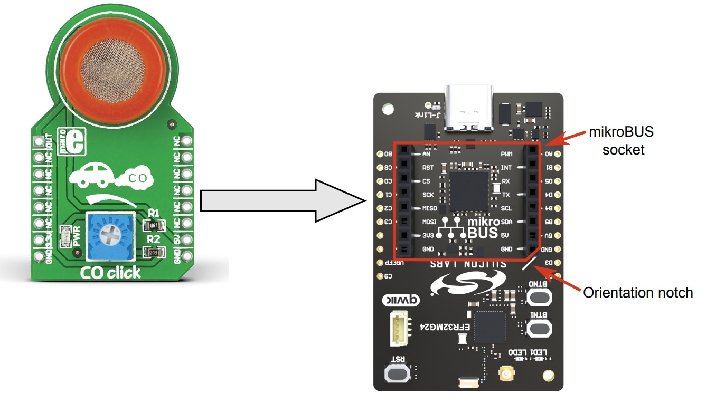

## Setup ##

### Setting up Home Assistant (Raspberry Pi) ###

Install the **Matter Server**, and the **Advanced SSH & Web Terminal** Addon.
In the Next step we will add support for our custom clusters to Home Assistant.
Note that this change will not persist after a Home Assistant Core update.

- In Advanced SSH & Web Terminal Configuration set protection mode to off.
- Enter the terminal, or ssh 
- **docker ps** to see container ids
- find the CONTAINER ID for ghcr.io/home-assistant/raspberrypi4-64-homeassistant
- execute 
```
docker exec -it <CONTAINER ID> bash
```
- (optional) You can use nano to edit pyhon files in the container. To install nano execute these commands inside the container:

```
apk update
apk add nano
```

- add to the discovery schemas (should be added after the last one, to the bottom of the script file) in: /usr/src/homeassistant/homeassistant/components/matter/sensor.py
    - If you are using nano to edit the file, the command should look like this: nano /usr/src/homeassistant/homeassistant/components/matter/sensor.py
  
```py
    MatterDiscoverySchema(
        platform=Platform.SENSOR,
        entity_description=MatterSensorEntityDescription(
            key="CarbonMonoxideSensor",
            device_class=SensorDeviceClass.CO,
            native_unit_of_measurement=CONCENTRATION_PARTS_PER_MILLION,
            suggested_display_precision=0,
            state_class=SensorStateClass.MEASUREMENT,
        ),
        entity_class=MatterSensor,
        required_attributes=(Clusters.CarbonMonoxideConcentrationMeasurement.Attributes.MeasuredValue,),
        should_poll=True,
    ),
```

Restart the Home Assistant Core container to apply the changes in the discovery schema.

### Creation of the CO Detector over Thread project ###

In this tutorial, a Matter - SoC Sensor over Thread project will be created and modified to interface with the CO Detector

**Note:**

- Make sure the [Silicon Labs Matter Extension](https://github.com/SiliconLabs/matter_extension) is already installed with your GSDK: [Preferences > Simplicity Studio > SDKs](https://github.com/SiliconLabs/third_party_hw_drivers_extension/blob/master/README.md#how-to-add-to-simplicity-studio-ide)
- (Optional) Make sure the [Third Party Hardware Drivers Extension](https://github.com/SiliconLabs/third_party_hw_drivers_extension) is already installed with your GSDK. Instructions to do so can be found [here](https://github.com/SiliconLabs/third_party_hw_drivers_extension?tab=readme-ov-file#how-to-add-to-simplicity-studio-ide)

There are two ways to set up the project:

1. The first way, is to create the project based on the example project.
   1. From the Launcher Home, add your hardware to My Products, click on it, and click on the EXAMPLE PROJECTS & DEMOS tab. Find the example project with the filter "Detector".
   2. Click Create button on Matter - CO Detector over Thread example. Example project creation dialog pops up -> click Create and Finish and the projects will be generated.
   3. Build and flash the examples to the board.
   4. After finishing this step, you can continue with the **Commissioning the CO Detector** section. 
      - Do not forget to flash a bootloader to your board, see [Bootloader](https://github.com/SiliconLabs/bluetooth_applications/blob/master/README.md#bootloader) for more information.

2. The second way is to make and modify the project as described by the following section.

#### Create a project based on an example project ####

1. From the Launcher Home, add your hardware to My Products, click on it, and click on the EXAMPLE PROJECTS & DEMOS tab. Find the example project with the filter "Sensor".

    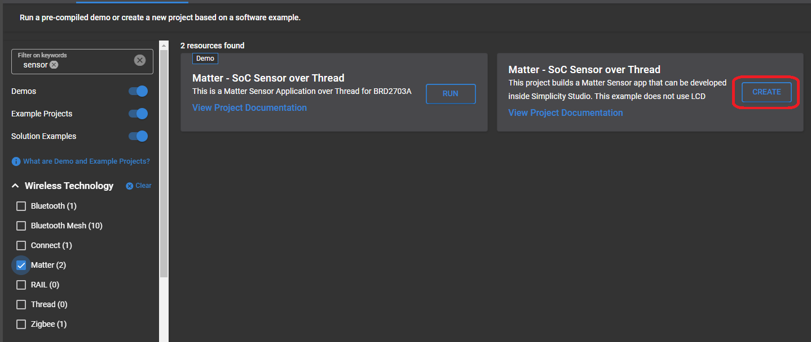

2. Click Create button on the **Matter - SoC Sensor over Thread Solution** example. When the example project creation dialog pops up click Create (Select Copy Contents!) and Finish and the projects will be generated.

3. Open the Zigbee Cluster Configurator (You can find this in project's .slcp file, under the **CONFIGURATION TOOLS** tab)
    
    1. Change Endpoint 1 device type to **Matter Air Quality Sensor** , delete Endpoint 2 and Endpoint 3, then open the Measurement & Sensing tab

    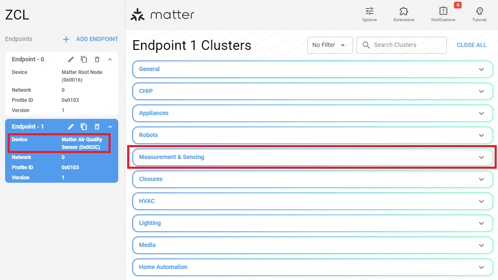

    2. Disable all clusters except the Carbon Monoxide Concentration Measurement Cluster. If you get a yellow exclamation mark next to this cluster, then click on it and press Install.

    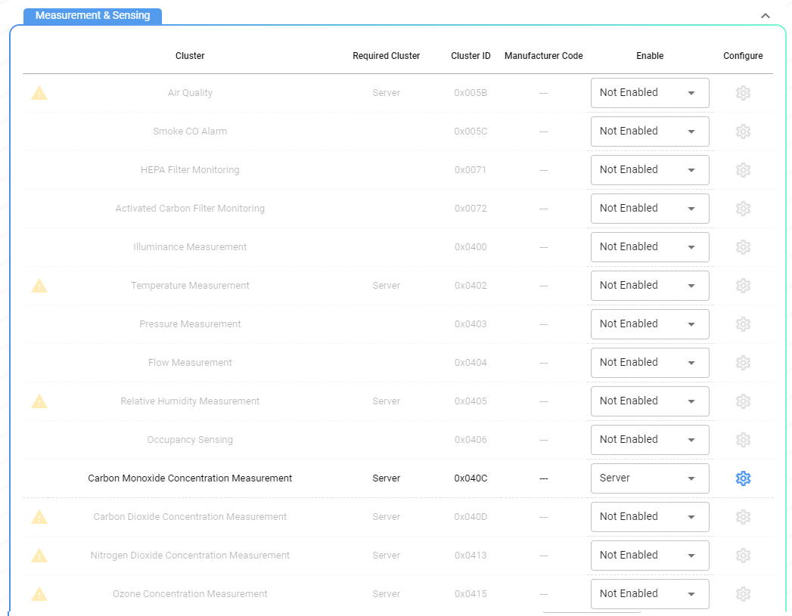

    3. Click on the cogwheel next to the Carbon Monoxide Concentration Measurement Cluster and enable the MeasuredValue attribute. Enable this attribute on the Attribute Reporting tab as well.

    4. Save and wait for the project generation

4. Enable the Third Party Hardware Drivers extension in the Software Components tab (to see it you need to remove the quality filter for Production Ready) and add the **MQ7 - CO Click (Mikroe)** components to the project.

6. Copy the contents of the **src** and the **include** folders in this repo to the project and choose overwrite existing files.
    - The app reads the sensor value every 10s by default. If you want to change this, then you can edit the **READING_INTERVAL_MSEC** macro in AppTask.c

8. Delete the SensorsCallback.cpp from the project's src folder and the SensorsCallback.h from the project's include folder.

9. Build and flash the project to the Explorer Kit

**Note:**

- Do not forget to flash a bootloader to your board, see [Bootloader](https://github.com/SiliconLabs/bluetooth_applications/blob/master/README.md#bootloader) for more information.

### Commissioning the CO Detector ###

This section will be about the whole commissioning process. After flashing, you need to commission the Device to Google Home (which connects the Explorer Kit to the Nest Hub's Thread network), then add the device to the fabric of Home Assistant, to see the data reported by the custom clusters used in this project. (As Google Home does not support custom clusters). 

#### Creating the project and Matter integration ####

1. Log into your (Google Developer Console](https://console.home.google.com/projects) and _Create a project_. If you don't have one, then you need to create it first.

    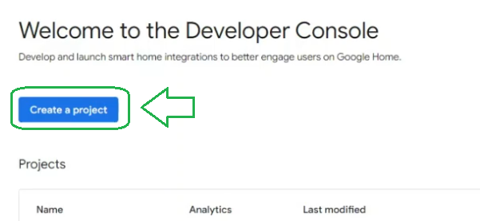

    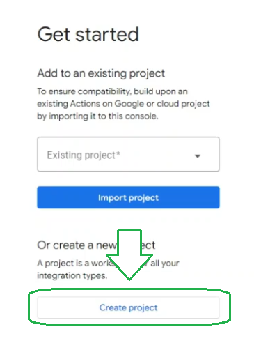

2. Name your project and click on _Create project_.

3. From the sidebar, click _Develop_.

    

4. Click on _Add integration_.

    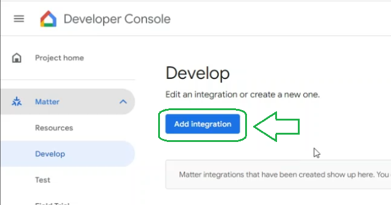

5. Click on _Next: Develop_.

    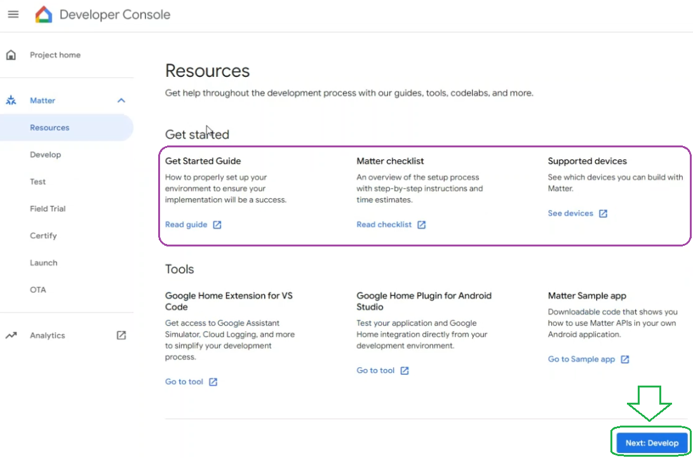

6. Click _Next: Setup_.

    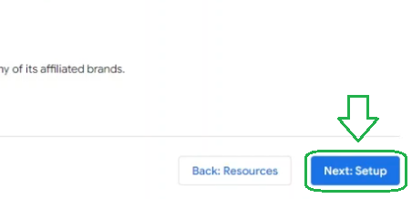

7. Enter a product name and select a device type.

8. Select the vendor ID to be a _Test VID_ and choose _0xFFF1_ from the dropdown. Set PID to 0x0001.

9. Click on _Save & continue_.

    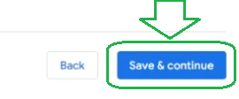

You should now see your new integration listed under _Develop_.

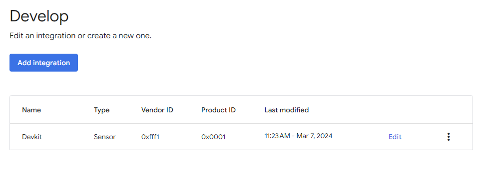

#### Commissioning ####

1. Open the Google Home Application on your smartphone / tablet.

2. Select the devices icon, and click on the _Add_ button.

    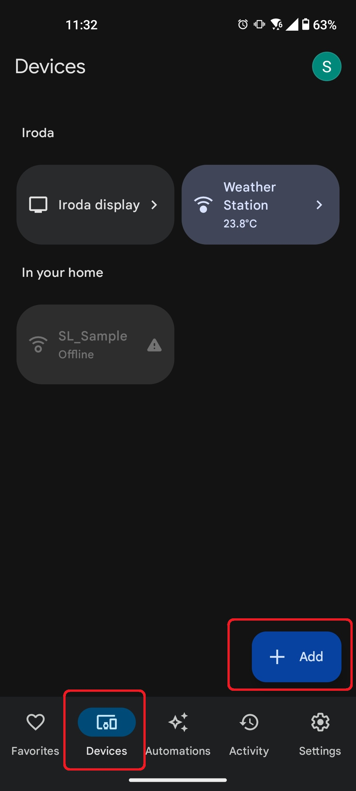

3. Choose to set up a new Matter-enabled device.

    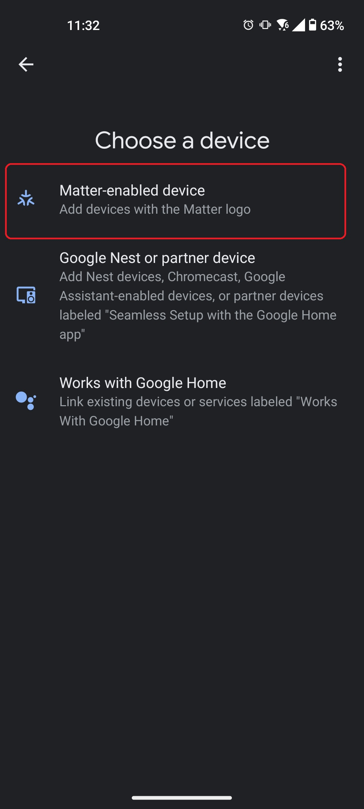

4. In the CLI of the Explorer Kit issue the **onboardingcodes ble** command, and click on the link to get the QR code for commissioning.

5. Wait for the device to finish the commissioning process, and name the device _CO Sensor_

6. Select the device on the Devices tab, click to cogwheel and select _Linked Matter apps & services_

    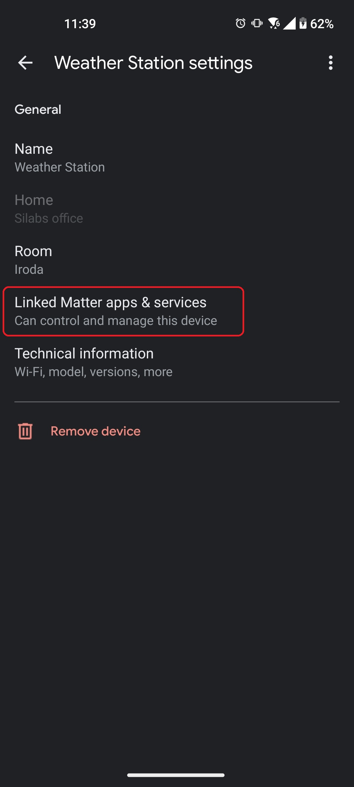


7. Select _Link apps & services_ and select Home Assistant.

8. Continue the setup in the Home Assistant App.

If you have done everything correctly you should see the device in Home Assistant under Devices & Services - Matter called SL_Sample

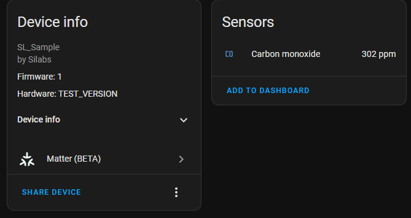

## How It Works ##

The app reads the sensor data from the Mikroe CO Sensor, then sets the MeasuredValue attribute of the Carbon Monoxide Concentration Measurement Cluster.
The Home Assistant reads this value periodically and displays it in ppm.