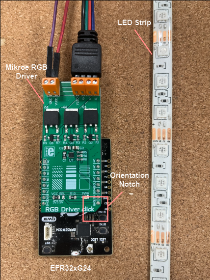
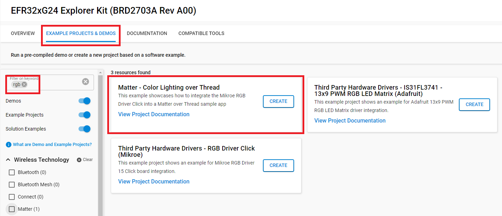
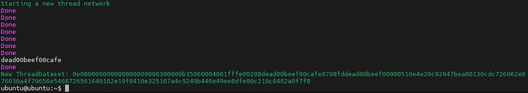

# Matter - Color Lighting over Thread #


## Summary ##

Accross this tutorial, we will go over the implementation of a RGB Driver on Matter. This is done with the Led Strip example.

## SDK version ##

- [SiSDK v2024.12.0](https://github.com/SiliconLabs/simplicity_sdk)
- [Third Party Hardware Drivers v4.1.0](https://github.com/SiliconLabs/third_party_hw_drivers_extension)
- [Silicon Labs Matter v2.5.0](https://github.com/SiliconLabs/matter_extension)

## Hardware Required ##

- 1x Raspberry Pi 4
- 1x Silabs board for Radio Co-Processor (RCP)
- 1x Mikroe RGB Driver Click Board
- 1x Silabs EFR32xG24 Explorer Kit (BRD2703A)
- 1x Led Strip
- Ubuntu Linux build environment on hardware or VirtualBox already used to build an initial MAD Light example from SMG

## Connections Required ##

- Ethernet or Wi-Fi for RasPi, Linux build machine
- USB-C for RCP/RasPi
- USB-C for Silabs Boards

## How It Works ##
RGB Driver Click is an RGB LED driver, capable of driving RGB LED stripes, LED fixtures and other RGB LED applications that demand an increased amount of current and voltage. This project showcases how to control remotely the RGB Driver Click via the Matter Controller, also known as the Matter HUB, on the Raspberry Pi.

This tutorial expects that you already built a simple MAD Lighting App, interacted with the Matter Hub/OTBR on the RaspeberryPi.

This turtorial comes with attached files corresponding to source codes for the application. 

## Setup ##

### Hardware Connection ###

The RGB Driver Click board supports MikroBus, so it can connect easily to EFR32xG24 Explorer Kit's MikroBus header. Be sure that the 45-degree corner of the Click Board™ matches the 45-degree white-line of the Silicon Labs Explorer Kit.

The hardware connection is shown in the image below:



### Setting up the Matter Hub (Raspberry Pi) ###

The Matter Hub consists of the Open Thread Border Router (OTBR) and the chip-tool running on a Raspberry Pi. Silicon Labs has developed a Raspberry Pi image combining the OTBR and chip-tool that can be downloaded from [Matter Artifacts page](https://docs.silabs.com/matter/1.0.5/matter-thread/prerequisites-artifacts).

### Flash the RCP ###

The Radio Co-Processor (RCP) is a Thread device that connects to the Raspberry Pi via USB. You can use the Simplicity Commander to flash images for the RCP. Prebuilt RCP images are available in here: [How To Build and Flash the RCP](https://docs.silabs.com/matter/1.0.5/matter-thread/rcp).

### Running Matter - Color Lighting over Thread ###

In this tutorial, Matter - SoC Lighting over Thread acts as the lighting device and we will use our voice to control it. You can find and run the **Matter - Color Lighting over Thread** easily on Simplicity Studio.


**Note:**

- Make sure the [Silicon Labs Matter Extension](https://github.com/SiliconLabs/matter_extension) is already installed with your GSDK: [Preferences > Simplicity Studio > SDKs](https://github.com/SiliconLabs/third_party_hw_drivers_extension/blob/master/README.md#how-to-add-to-simplicity-studio-ide).

#### Create a project based on an example project ####

1. From the Launcher Home, add your hardware to My Products, click on it, and click on the EXAMPLE PROJECTS & DEMOS tab. Find the example project with the filter "RGB".

2. Click Create button on **Matter - Color Lighting over Thread** example. Example project creation dialog pops up -> click Create and Finish and the projects will be generated.



3. Build and flash the examples to the board.

#### Start with Matter - SoC Lighting over Thread project ####

1. Create **Matter - SoC Lighting over Thread** project for your hardware using SimplicityStudio 5.

2. Copy _**src**_ folder into the project root folder (overwriting existing).

3. Build and flash the project.

**Note:**

- Make sure that this repository is added to [Preferences > Simplicity Studio > External Repos](https://docs.silabs.com/simplicity-studio-5-users-guide/latest/ss-5-users-guide-about-the-launcher/welcome-and-device-tabs).

- Do not forget to flash a bootloader to your board, see [Bootloader](https://github.com/SiliconLabs/bluetooth_applications/blob/master/README.md#bootloader) for more information.

### Creating Thread Network and Commissioning ColorLighting and Binding Device ###

After flashing all the required binaries to the corresponding hardware, you need to start a new Thread network from the local OTBR that is running on the Raspberry Pi. When the Thread network is already created, you need to commission the device into the network. Follow these commands below to finish the network:

- Start a new Thread network:

    ```C
    mattertool startThread
    ```

    After creating Thread network successfully, you will get the result below.

    

- Commissioning Lighting device:

    ```C
    mattertool pairing ble-thread [nodeID-light] hex: [HEX] 20202021 3840
    ```

- Commissioning ColorLighting dection device:

    ```C
    mattertool pairing ble-thread [nodeID-SensoryWakeWord] hex: [HEX] 20202021 3840
    ```

    **Note:** You can choose random numbers as the nodeID for ColorLighting, and the HEX the blue code will be printed out on the terminal when you created the Thread network.

## Commission and control the lighting device ##

Once the firmware has been flashed onto your Matter Accessory device you can commission it from the Matter Hub using the commands provided in the Raspberry Pi image:

| Command | Usage | Note |
| ---------------------------| ----------------- | --------------------- |
| mattertool startThread | Starts the thread network on the OTBR |    |
| mattertool bleThread | Starts commissioning of a MAD using chip-tool |   |
| mattertool -h | Gets the Node ID of your MAD |    |
| mattertool on | Sends an **on** command to the MAD using chip-tool |    |
| mattertool off | Sends an **off** command to the MAD using chip-tool |   |
| mattertool levelcontrol move-to-level {desired\_level} 0 1 1 {node\_ID} 1 | Sets the brightness level (color intensity) | Level range: 0 - 254 |
| mattertool colorcontrol move-to-saturation {desired\_saturation} 0 1 1 {node\_ID} 1 | Sets the saturation value | Value range: 0 - 254 |
| mattertool colorcontrol move-to-hue {desired\_hue} 0 0 1 1 {node\_ID} 1  | Sets the Hue value | Value range: 0 - 254 |

The HSV (Hue/Saturation/Intensity) colorspace as it relates to RGB LEDs is a complicated subject, and converting to an 8 bit range adds to that. You can find a lot of material online regarding this system; [this Wikipedia article](https://en.wikipedia.org/wiki/HSL_and_HSV) is a good place to begin.

Here are some fun values to test out using the mattertool commands:

| Hue | Saturation | Level |
| ----- | ----- | ----- |
| 45 | 5 | 10 |
| 90 | 54 | 10 |
| 135 | 243 | 210 |
| 175 | 5 | 10 |
| 220 | 24 | 90 |

For example, if your Node ID is **22913**, issue the following 3 commands:  

`$ mattertool colorcontrol move-to-hue 220 0 0 1 1 22913 1`  

`$ mattertool colorcontrol move-to-saturation 24 0 1 1 22913 1`  

`$ mattertool levelcontrol move-to-level 90 0 1 1 22913 1`
