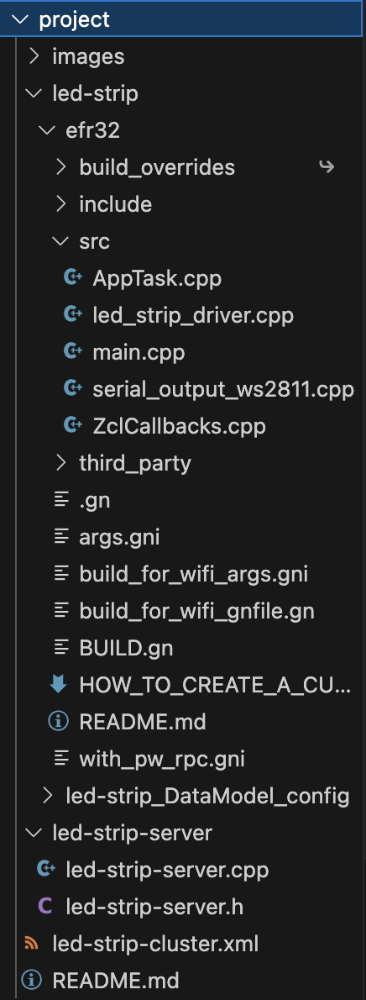

# Custom Cluster for Led Strip MAD #


## Summary ##

Accross this tutorial, we will go over the implementation of a custom cluster on Matter. It will guide you on how to create your custom cluster on both the Matter Accessory Device (MAD) and the Matter Controller. This is done with the Led Strip example.

## Gecko SDK version ##

SMG 2.1.0-1.1

## Hardware Required ##

- Raspberry Pi 4
- 1 x Silabs board for Radio Co-Processor (RCP)
- 1 x Silabs Dev Kit (BRD4187C)
- 1 x Led Strip with WS2811 (see references)
- Required power adapter and level converter to transform SPI levels from 3.3V to 5V
- Ubuntu Linux build environment on hardware or VirtualBox already used to build an initial MAD Light example from SMG

***Note:* In the WorksWith2022 seminar, you may have used the Wirebridge USB Flashstick; the provided RCP is not compatible with this project.**

## Connections Required ##

- Ethernet or Wi-Fi for RasPi, Linux build machine
- USB-C for RCP/RasPi
- USB-C for Silabs Boards


## Overview ##
The LED Strip example is using a **Custom Cluster**, called *My Led Strip*, configured with pre-defined attributes and commands in order to control remotely a LED Strip via the Matter Controller, also known as the Matter HUB, on the Raspberry Pi.
This tutorial expects that you already built a simple MAD Lighting App, interacted with the Matter Hub/OTBR on the RaspeberryPi.
It is also preferred to go over the Matter Custom MAD example (see references for links).

This turtorial comes with attached files corresponding to source codes for both the custom cluster and the application. 
Its primary goal is to explains how to work with Custom Clusters.

## Prerequisites ##
First, we will go over the creation of the custom cluster and its inclusion in the SMG repo / applications. 
We will be creating a project from the template, using the ZAP tool to configure the endpoints, clusters and attributes, and then adding code to make it all work.

This tutorial expects you to have built a MAD on your local setup, following either:
- The [Lab Manual and updates](https://community.silabs.com/s/article/MAT-301-Lab-Update-Works-With-2022?language=en_US) from the Silicon Labs WorksWith2022 MAT-301 seminar

or:

- The guides found in SMG:
    - [Matter over Thead demo overview](https://github.com/SiliconLabs/matter/blob/release_2.1.0-1.1/docs/silabs/thread/DEMO_OVERVIEW.md)
    - [Matter lighting demo](https://github.com/SiliconLabs/matter/tree/latest/examples/lighting-app/silabs)
    - [Creating a custom application](https://github.com/SiliconLabs/matter/blob/release_2.1.0-1.1/silabs_examples/template/efr32/HOW_TO_CREATE_A_CUSTOM_APP.md)
- The **RaspberryPi OTBR .img** and **RCP** ***must be from SMG 2.1.0-1.1*** for this tutorial
- SMG 2.1.0-1.1 requires GCC version 12.2.1 which can be found here: [GCC](https://gcc.gnu.org/gcc-12/).

It also expects that you have been through the buidling and creation of a **custom MAD** findable at :
- https://github.com/SiliconLabs/matter_applications_staging/tree/master/matter_thread_custom_mad

Silicon Labs Matter Github repository:
- You should already have the Silicon Labs Matter repository with submodules, but you may be on a prior version. If so, check out the current version tag seen in [SMG](https://github.com/SiliconLabs/matter):

	`$ git checkout release_2.1.0-1.1`
- You may need to stash any changes you've made in the prior version:

	`$ git stash`
- Clone the Silicon Labs Matter repository with its submodules:
	- See the instructions under [Software Requirements](https://github.com/SiliconLabs/matter/blob/release_2.1.0-1.1/docs/silabs/general/SOFTWARE_REQUIREMENTS.md).

 ***Note:** Unless otherwise specified, the commands in the tutorial are run from inside the directory of the cloned Silabs Matter repository, eg. **~/matter$**.*

## Architecture of the Example ## 

This repository contains the following directory structure :

- **led-strip** : It contains the project with the source code, the build script and its data model. 
  - **serial_output_ws2811** : Driver to handle the control of the driver circuit based on 2811. It is possible to adapt this driver for the WS2812b but some changes are to be expected (more information in the source code).
  - **led_strip_driver** : Driver for led strip features such as color control and other effects. 
- **led-strip-server** : This directory contains the source code for the Led Strip custom cluster.
- **led-strip-cluster.xml** : Custom cluster xml implementation. It contains the declaration of the attributes, commands and different properties of the cluster. 

It is possible to directly copy paste the matter_applications_custom_cluster repository to your matter repo, rename the directory to project, and use directly the whole project. Some steps, described below, are still to be followed.

## Setup ##

## Step 1 : Cluster Definition with XML ##
First of all, an XML file to be read by ZAP has to be created. This file is responsible for the definition of the Attributes types, commands, events, but also all the information regarding your custom cluster. Refer to the led-strip-cluster.xml file presents in this repo.
Attributes are mostly defined on the server side has it is where the application is going to be processed. The co

Every clusters are defined by : 
* Attributes
```xml
<attribute side="server" code="0x0000" define="RED_COLOR" type="INT8U" min="0x00" max="0xFF" writable="true" default="0x00" optional="true">Name</attribute>
```
Side is either server or client. The code of the attribute is going to be between 0x0000 and 0xFFFF. It is the local code of the attribute into the cluster.
* Commands
```xml
<command source="client" code="0x00" name="SetColor" optional="false" cli="zcl led-strip SetColor">
      <description>
        Specific command to set the value of the R/G/B.
        Example of command : zcl led-strip SetColor "Red" "Green" "Blue". 
      </description>
      <arg name="RedColor" type="INT8U"/>
      <arg name="GreenColor" type="INT8U"/>
      <arg name="BlueColor" type="INT8U"/>
    </command>
```
* Code : The Code of the cluster is going to be the id of this cluster. Manufacturing code having currently an issue combined with the code. 
In this format, you are going to reference both the Manufacturing Id and the Code of the cluster
Ex : 0xFFF1FFC1 : FFF1 is the single "manufacturer code" that has been tested. FFC1 is the cluster Id.
The Cluster Id has to in the range 0xFC00 to 0xFFFE. 
* Domain : Domain 

## Step 2 : Cluster source code for the Server
The second step of making the cluster implementation resides in write the server source code that will allow you to do different step.
The overall idea is to reside on commands callbacks
These callbacks are generated with the whole zap environment (regenerating every example). 

The form of the callback to implement is : emberAf<ClusterName>Cluster<Command>Callback.

Ex : emberAfLedStripClusterSetColorCallback is the callback for the cluster LedStrip and the command SetColor.
It is important to define each callback.

## Step 3 : Adding references of the new cluster. 
First of all, we need to add in the **{matter}/src/app/zap-templates/zcl/data-model/all.xml** file the reference to the custom cluster by adding the following line :
```xml
...
  <xi:include href="../../../../project/led-strip-cluster.xml" />
</all>
```
Replace by the relative path from the matter repo to the custom cluster xml file. 

Then, we have to change the zcl.json file to include the cluster definition. This file is located under **{matter}/src/app/zap-templates/zcl/zcl.json**.
First, add the path to the directory containing the custom cluster xml file.
```json
"xmlRoot": [
        ".",
        "./data-model/chip/",
        "./data-model/draft/",
        "./data-model/silabs/",
        "../../../../project/"
    ],
```
Then, we are going to **add the cluster xml** file to the xmlfile variable : 
```json
"xmlFile": [
  ...
  "led-strip-cluster.xml",
  ...
```

Then, we are going to add the client directories to the file **zap_cluster_list.json**. This file is located under **{matter}/src/app/zap_cluster_list.json**.
You have to add to the server directories the following line : 
```json
"ServerDirectories": {
  ... 
  "LED_STRIP_CLUSTER": ["led-strip-server"]
},
```
It is also necessary to add it to the client directories variable
```json
"ClientDirectories": {
  ...
  "LED_STRIP_CLUSTER": []
}
```
If you are using your custom cluster, change the name from **LED_STRIP_CLUSTER** to **{YOUR_CLUSTER_DEFINE}**. YOUR_CLUSTER_DEFINE being the value in the define into the custom cluster xml file.
```xml
  <define>LED_STRIP_CLUSTER</define>
```

## Step 4 : Adding the clusters in the zap files.
After adding the reference to the zap configuration about the custom cluster, it is important to change the project zap file which will represent the "data model" configuration, for both the server (led strip device) and the client (controller). 

1. For the MAD, you have to execute the following command : 
```zsh
./scripts/tools/zap/run_zaptool.sh <your-project>/<your-project>_DataModel_config/project_name.zap

Ex : ./scripts/tools/zap/run_zaptool.sh project/led-strip/led-strip_DataModel_config/led-strip.zap
```
A window should pop up. Go to the Endpoint 1, search for the custom cluster and enable it has a Server Cluster has shown below.


In the configure tab, don't forget to enable every attribute and commands for the application being used. In this example, we are going to enable all of them since they are all used by the application. 


2. For the controller, you have to execute the following command to launch the controller zap configuration : 
```
./scripts/tools/zap/run_zaptool.sh src/controller/data_model/controller-clusters.zap
```
Once the window opens, just like the previous step, you can enable the client side of the custom cluster on your endpoint 1. There shouldn't be any attributes to enable since none have been defined for the client. 
All the commands have to be enable too to be able to support it on both ends.

Note : Endpoint 0 contains the basic/default clusters used by the device just like basic information, access control, time localization ... Implementation of the different features for the application has to be done on another endpoint, therefore the use of endpoint 1.

If you see an **UNSUPPORTED_COMMAND** error, it is most likely that one commands is not enabled in this file. 

## Step 5 : Generating zap files and code. 
After making the above changes, the zap generated code needs to be updated. Therefore, we can call the global generation of all zap related codes.
`./scripts/tools/zap_regen_all.py`

These steps might take quite some time in order to be able to produce all the related codes.

## Step 6 : Building the Chip-Tool for the Controller
After regenerating the whole zap, you have to build the chip-tool. Here's the command to execute :
```zsh
./scripts/examples/gn_build_exanples.sh examples/chip-tool out/
```

Make sure that the custom cluster is present and that all the commands are enabled in the controller.zap file.

Chip-tool generated files should now be present in the out/chip-tool directory.

This is needed for the controller. One advice would be to copy paste to the matter controller this repository in order for it to be used.

If the controller doesn't have access to the chip-tool generated files, 

## Step 7 : Build the project
The last step consists on developing the application for the custom MAD. Once this is done, it is necessary to build the application.
Generally, the command to build with SMG 2.1.1-1.1 is the following, applied for the led-strip project :

```zsh
./scripts/examples/gn_efr32_example.sh ./project/led-strip/efr32 ./out/led-strip BRD4187c show_qr_code=false disable_lcd=true chip_detail_logging=true is_debug=true chip_openthread_ftd=true enable_openthread_cli=false segger_rtt_buffer_size_up=4096
```

These building arguments disable the cli openthread which is used by the USART, increase the RTT buffer to have access to all the logs without any issues. It also enables the full logging features for better tracking as part of the example.

## Step 8 : Flash the firmware
This step simply consists in flashing the firmware to your device. Don't forget to add a bootloader if necessary.
If the application is not running, it is most likely coming from a missing bootloader.

## Step 9 : Start the Network, commission and control the MAD
Once the firmware has been flashed onto the device, it is possible from the Matter Hub/controller to use commands to commission and control the MAD. 
In this project with the led-strip, it is possible to control the different color and to turn on or off the led strip. 

| Command | Usage | Note |
| ---------------------------| ----------------- | --------------------- |
| mattertool startThread | Starts the thread network on the OTBR |    |
| mattertool bleThread -n {node_ID} | Starts commissioning of a MAD using chip-tool to the given node ID |   |
| mattertool -h | Gets the Node ID of your MAD |    |
| mattertool ledstrip set-color {red\_color} {green\_color} {blue\_color} {node\_ID} 1 | Sets the color intensity | Level range: 0 - 254 |
| mattertool ledstrip set-state {state\_value} {node\_ID} 1 | Sets the state value | Value range: 0 - 254 |
| mattertool ledstrip on-off-strip {OnOffValue} {node\_ID} 1  | Sets the on/off value | Value range: 0 - 254 |

At the moment, the set-state command does not have any impact on the led strip driver since this is some future features to be implemented. The idea would be to use the state to provide fading feature, blinking, transitions and so forth. 
There is some existing libraries which provides some good information on this different features and that doesn't require too much work to implement.

## How It Works ##
More explanations of the project and how the driver for the led strip works can be found within the project's codes.

As for the custom MAD example that is advise to look at before going over this tutorial, the "link" between the led driver and the custom cluster from matter is made within the ZclCallbacks.cpp file. More precisely, the function **MatterPostAttributeChangeCallback** is going to call the corresponding events to execute the different change in the application and call the related functions in the led-strip driver.

## Issues encountarable
- If you see multiple instances of the custom cluster while opening Electron/Zap, delete the .zap directory in your user base folder on your computer.
- Sometimes, the cluster Id is not going to be recognized, make sure to use the format referred in this tutorial.

## References ##
- https://cdn-shop.adafruit.com/datasheets/WS2811.pdf
- https://github.com/project-chip/connectedhomeip
- https://github.com/SiliconLabs/matter_applications_staging/tree/master/matter_thread_custom_mad