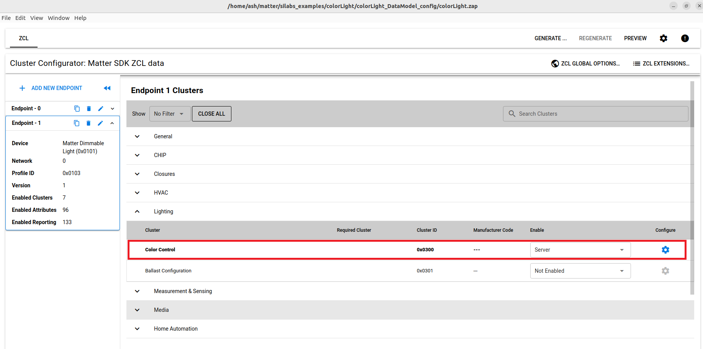

<table border="0">
  <tr>
    <td align="left" valign="middle">
    <h1>Tutorial: Matter over OpenThread Custom Matter Device</h1>
  </td>
  <td align="left" valign="middle">
    <a href="https://www.silabs.com/wireless/matter">
      
    </a>
     <a href="https://www.silabs.com/wireless/matter">
      
  </td>
  </tr>
</table>

# Color Control Light MAD #


## Summary ##

This tutorial will show you how to create and build a dimmable RGB light app (Color Control Light Matter Accessory Device) from the Silicon Labs Matter Github (SMG) repository's existing template app for ThunderBoard Sense 2 (BRD4166A).

## Gecko SDK version ##

SMG 2.1.0-1.1

## Hardware Required ##

- Raspberry Pi 4
- 1 x Silabs board for Radio Co-Processor (RCP) 
- 1 x Silabs Thunderboard Sense 2 (TBS2 -- BRD4166A)
- Ubuntu Linux build environment on hardware or VirtualBox already used to build an initial MAD Light example from SMG

***Note:* In the WorksWith2022 seminar, you may have used the Wirebridge USB Flashstick; the provided RCP is not compatible with this project.**

 
## Connections Required ##
 
- Ethernet or Wi-Fi for RasPi, Linux build machine
- Micro USB for RCP/RasPi
- Micro USB for TBS2/Linux 
 

## Overview ##

You have already built and interacted with the simple MAD Lighting App on a Thread network running on the OTBR on RaspberryPi. This tutorial is the next step; using a project template and modifying it to add features. If you have not already built the Lighting App and/or do not have a Thread network running on the OTBR on RaspberryPi please refer to the section titled "The guides found in SMG" under **Prerequisites.**

We will be creating a project from the template, using the ZAP tool to configure the endpoints, clusters and attributes, and then adding code to make it all work.  

To simplify the experience and provide a resource to check against, we will be building a project substantially similar to one of several examples Silicon Labs provides within SMG. This tutorial is not focused on writing code, so we'll be copying the files and code we need from the **sl-newLight** example, but we will still need to make adjustments based on this particular project.

## Prerequisites ##
<!--- 
Silabs Apps requirement seems to need Prerequisites to not be called a Step 0 (?) and maybe come before Setup. Alex to check
--->

This tutorial expects you to have built a MAD on your local setup, following either:
- The [Lab Manual and updates](https://community.silabs.com/s/article/MAT-301-Lab-Update-Works-With-2022?language=en_US) from the Silicon Labs WorksWith2022 MAT-301 seminar

or:

- The guides found in SMG:
    - [Matter over Thead demo overview](https://github.com/SiliconLabs/matter/blob/release_2.1.0-1.1/docs/silabs/thread/DEMO_OVERVIEW.md)
    - [Matter lighting demo](https://github.com/SiliconLabs/matter/blob/latest/examples/lighting-app/silabs/efr32/README.md)
    - [Creating a custom application](https://github.com/SiliconLabs/matter/blob/release_2.1.0-1.1/silabs_examples/template/efr32/HOW_TO_CREATE_A_CUSTOM_APP.md)
- The **RaspberryPi OTBR .img** and **RCP** ***must be from SMG 2.1.0-1.1*** for this tutorial
- SMG 2.1.0-1.1 requires GCC version 12.2.1 which can be found here: [GCC](https://gcc.gnu.org/gcc-12/).

***Note:** While the build in the MAD Light tutorial was done entirely in the Linux console, this tutorial works from the Ubuntu GUI. However, the only component that **requires** the Linux or Mac GUI is the **ZAP tool**. If necessary, this project can be built in the console without invoking the ZAP tool but it is best to use the tool if possible.*

Silicon Labs Matter Github repository: 
- You should already have the Silicon Labs Matter repository with submodules, but you may be on a prior version. If so, check out the current version tag seen in [SMG](https://github.com/SiliconLabs/matter):

	`$ git checkout release_2.1.0-1.1`  
- You may need to stash any changes you've made in the prior version:

	`$ git stash`
- Clone the Silicon Labs Matter repository with its submodules:
	- See the instructions under [Software Requirements](https://github.com/SiliconLabs/matter/blob/release_2.1.0-1.1/docs/silabs/general/SOFTWARE_REQUIREMENTS.md).

 ***Note:** Unless otherwise specified, the commands in the tutorial are run from inside the directory of the cloned Silabs Matter repository, eg. **~/matter$**.*


## Step 1: Set up your new project structure ##

Make a copy of the folder **silabs\_examples/template** in same directory and name the folder **colorLight**

Rename the files inside as follows:

*   ***template*\_DataModel\_config → *colorLight*\_DataModel\_config**
*   **sl\_*template*.matter → *colorLight*.matter**
*   **sl\_*template*.zap →  *colorLight*.zap**

At this point, the folder structure should look like this:


## Step 2: Modify the GN build file ##


Navigate to the **BUILD&period;gn** file inside **silabs\_examples/colorLight/colorLight\_DataModel\_config**. We will be modifying it to refer to the newly created project. 

*    First add a new config for the include directory. This block of code should go between the imports and the *chip\_data\_model*:

```cpp
config ("config") {
  include_dirs = [ "include' ]
}
```

*    Then change the chip data model to refer to the new project. Here is the new block to override the current chip data model:

```cpp
chip_data_model("colorLight_DataModel_config") {
  zap_file = "colorLight.zap"

  zap_pregenerated_dir = "${chip_root}/zzz_generated/colorLight/zap-generated"
  is_server = true
}
```


Now your **BUILD&period;gn** file should look like this:

```cpp
import("//build_overrides/chip.gni")
import("${chip_root}/examples/common/pigweed/pigweed_rpcs.gni")
import("${chip_root}/src/app/chip_data_model.gni")

config("config") {
  include_dirs = [ "include" ]
}

chip_data_model("colorLight_DataModel_config") {
  zap_file = "colorLight.zap"

  zap_pregenerated_dir = "${chip_root}/zzz_generated/colorLight/zap-generated"
  is_server = true
}
```

Save your updated **BUILD&period;gn** file.

## Step 3: Use ZAP tool ##

Run the ZAP tool, modify the clusters to fit the application requirement and save it. 

- Run the **ZAP tool** with the .zap file you just created at Step 1 as the argument:

    `$ ./scripts/tools/zap/run_zaptool.sh silabs_examples/colorLight/colorLight_DataModel_config/colorLight.zap`
  
	- ***NOTE:*** If this command fails, you may need to activate your development environment. Activate your environment with the bootstrap command:
 
 		- `$ source scripts/bootstrap.sh`
   		- Now try running the **ZAP tool** again

    ***Note:* If you do not have access to a GUI version of Ubuntu or MacOS to run ZAP, this command will fail.** For now you can follow along here to understand the process and then copy the *zap-generated* directory from */zzz_generated/sl-newLight/* to *zzz_generated/colorLight*, and continue to modify and build the project as described.
  
<!--- 
-------- getting rid of the startup page because 1, it changed, and 2, it is a large image that is not needed
On startup, the GUI should look like this:

 
 --->

*   Select **Endpoint 1** from the endpoint list on the left panel, this endpoint represents our RGB light functionality.

	A menu of its clusters, listed in groups, will show up:

	 

*   Select the **General** group at the top of the list
*   In the drop down menu make sure that **On/Off** cluster and **Level Control** cluster are both enabled with Server type

	These two clusters are responsible for turning on/off the light and controlling the brightness, respectively.

	

*   Select the blue gear representing the configuration option of the **Level Control** cluster:

	

*   Set the default value of **CurrentLevel** to 0xFE instead of 0:

	

*   Click **Back** to return to the outer panel
*   Select the **Lighting** group
*   In the drop down menu make sure that the **Color Control** cluster is enabled with Server type.

	This cluster provides the interface to for the remote client to control the color of the RGB light.

	

*   Select the blue gear representing the configure option of the **Color Control** cluster:

	

*   Make sure that "CurrentHue" and "CurrentSaturation" attributes are enabled:

	

*   Click **Back** to return to the outer panel
*   In the top left corner select File → Save to save the profile you just modified
*   Exit the ZAP tool by clicking the red "X" in the top right of the page

## Step 4: Generate source and header files ##

Use the newly modified .zap file to create project files.

*   Navigate to the **$~/matter/zzz\_generated/** folder
*   Create a folder with the name: **colorLight** inside **$~/matter/zzz\_generated**
	*   This folder will later be used by ZAP tool to create source file related to the cluster configuration of the Matter device
*   Create a second folder named **"zap-generated"** inside your newly created folder - **$~/matter/zzz\_generated/colorLight** 
*   Generate files with the following command:

    `$ ./scripts/tools/zap/generate.py silabs_examples/colorLight/colorLight_DataModel_config/colorLight.zap -o zzz_generated/colorLight/zap-generated/`

    ***Note:** the generated files will not show up in the **zap-generated** folder.*

*   Copy the file **af-gen-event.h** from **$~/matter/zzz\_generated/*lighting-lite-app*/zap-generated** to **$~/matter/zzz\_generated/*colorLight*/zap-generated** 
    

## Step 5: Integrate RGB lighting and dimming functionality ##

Copy the **sl-newLight** example project's four light control source and header files to the current project from
**~/matter/silabs_examples/sl-newLight/efr32/light_modules/**

| File | Copy To |
| ------------------------- | -------------------------------------------------- | 
| **led\_widget\_rgb.cpp**  | ~/matter/silabs_examples/colorLight/efr32/**src**/ |
| **LightingManager.cpp**  |  ~/matter/silabs_examples/colorLight/efr32/**src**/ | 
| **led\_widget\_rgb.h** |  ~/matter/silabs_examples/colorLight/efr32/**include**/ |
| **LightingManager.h** | ~/matter/silabs_examples/colorLight/efr32/**include**/ |


## Step 6: Add callbacks to handle light control events ##

Modify the file **AppTask.h** inside **$~/matter/silabs\_examples/colorLight/efr32/include**

*   Next to the other includes, include additional header file: **"LightingManager.h"**
	```cpp
 	#include "LightingManager.h"
 	```
*   Modify the class **AppTask** to add handlers for light control.

	Here is the new block of code to override the current **AppTask** class:
    
    ```cpp
    class AppTask : public BaseApplication
    {
    
    public:
        
        AppTask() = default;
        static AppTask & GetAppTask() { return sAppTask; }
        static void AppTaskMain(void * pvParameter);
        CHIP_ERROR StartAppTask();
    
    
        void ButtonEventHandler(const sl_button_t * buttonHandle, uint8_t btnAction) override;
        static void OnIdentifyStart(Identify * identify);
        static void OnIdentifyStop(Identify * identify);
    
        void PostLightActionRequest(int32_t aActor, LightingManager::Action_t aAction);
        void PostLightControlActionRequest(int32_t aActor, LightingManager::Action_t aAction, uint8_t value);
    
    private:
        static AppTask sAppTask;
    
        static void ActionInitiated(LightingManager::Action_t aAction, int32_t aActor);
        static void ActionCompleted(LightingManager::Action_t aAction);
        static void LightActionEventHandler(AppEvent * aEvent);
        static void LightControlEventHandler(AppEvent * aEvent);
        static void UpdateClusterState(intptr_t context);
        static void ButtonHandler(AppEvent * aEvent);
        CHIP_ERROR Init();
    };
    ```
    

Modify the file **AppTask.cpp** inside **silabs\_examples/colorLight/efr32/src/**, implementing functions to handle light control events.

*   Next to the other includes, include additional header file: **"led\_widget\_rgb.h"**
	```cpp
 	#include "led_widget_rgb.h"
 	```
*   Add a device of type RGB led to your project by adding an object of type **LIGHT\_LED\_RGB**:
	```cpp
 	...
 	namespace {

 	#define LIGHT_LED_RGB &sl_led_rgb_pwm
 	LEDWidgetRGB sLightLED;

 	EmberAfIdentifyEffectIdentifier sIdentifyEffect = EMBER_ZCL_IDENTIFY_EFFECT_IDENTIFIER_STOP_EFFECT;
 	...
 	```

        
*   Modify the initialization function, in which we will setup the appropriate callbacks.

	Here is the new block of code to override the current **AppTask::Init** function:
    
    ```cpp
    CHIP_ERROR AppTask::Init()
    {
        CHIP_ERROR err = CHIP_NO_ERROR;

        err = BaseApplication::Init(&gIdentify);
        if (err != CHIP_NO_ERROR)
        {
            SILABS_LOG("BaseApplication::Init() failed");
            appError(err);
        }
    
        err = LightMgr().Init();
        if (err != CHIP_NO_ERROR)
        {
            SILABS_LOG("LightMgr::Init() failed");
            appError(err);
        }
        LightMgr().SetCallbacks(ActionInitiated, ActionCompleted);
    
        LEDWidgetRGB::InitGpioRGB();
        sLightLED.Init(LIGHT_LED_RGB);
    
        sLightLED.Set(LightMgr().IsLightOn());
    
        return err;
    }
    ```
    
To implement the missing callbacks to respond to the new commands, add these functions to the end of the file:
- Add an event handler for the light:
    
    ```cpp
    void AppTask::LightActionEventHandler(AppEvent * aEvent)
    {
        bool initiated = false;
        LightingManager::Action_t action;
        int32_t actor;
        CHIP_ERROR err = CHIP_NO_ERROR;
    
        if (aEvent->Type == AppEvent::kEventType_Light)
        {
            action = static_cast<LightingManager::Action_t>(aEvent->LightEvent.Action);
            actor  = aEvent->LightEvent.Actor;
        }
        else if (aEvent->Type == AppEvent::kEventType_Button)
        {
            if (LightMgr().IsLightOn())
            {
                action = LightingManager::OFF_ACTION;
            }
            else
            {
                action = LightingManager::ON_ACTION;
            }
            actor = AppEvent::kEventType_Button;
        }
        else
        {
            err = APP_ERROR_UNHANDLED_EVENT;
        }
    
        if (err == CHIP_NO_ERROR)
        {
            initiated = LightMgr().InitiateAction(actor, action);
    
            if (!initiated)
            {
                SILABS_LOG("Action is already in progress or active.");
            }
        }
    }
    ```
- Add a function to initiate the action:

    ```cpp
    void AppTask::ActionInitiated(LightingManager::Action_t aAction, int32_t aActor)
    {
        bool lightOn = aAction == LightingManager::ON_ACTION;
        SILABS_LOG("Turning light %s", (lightOn) ? "On" : "Off")
        sLightLED.Set(lightOn);
    
        if (aActor == AppEvent::kEventType_Button)
        {
            sAppTask.mSyncClusterToButtonAction = true;
        }
    }
    ```
- Add a function to complete the action:

    ```cpp
    void AppTask::ActionCompleted(LightingManager::Action_t aAction)
    {
        // action has been completed on the light
        if (aAction == LightingManager::ON_ACTION)
        {
            SILABS_LOG("Light ON")
        }
        else if (aAction == LightingManager::OFF_ACTION)
        {
            SILABS_LOG("Light OFF")
        }
        if (sAppTask.mSyncClusterToButtonAction)
        {
            chip::DeviceLayer::PlatformMgr().ScheduleWork(UpdateClusterState, reinterpret_cast<intptr_t>(nullptr));
            sAppTask.mSyncClusterToButtonAction = false;
        }
    }
    ```
- Add a function to control the light:

    ```cpp
    void AppTask::LightControlEventHandler(AppEvent * aEvent)
    {
        /* 1. Unpack the AppEvent */
        uint8_t light_action = aEvent->LightControlEvent.Action;
        uint8_t value = aEvent->LightControlEvent.Value;
    
        /* 2. Execute the control command. */
        if (light_action == LightingManager::MOVE_TO_LEVEL)
        {
            sLightLED.SetLevel(value);
            SILABS_LOG("Level set to: %d.", value);
        }
        else if (light_action == LightingManager::MOVE_TO_HUE)
        {
            sLightLED.SetHue(value);
            SILABS_LOG("Light LED hue set.");
        }
        else if (light_action == LightingManager::MOVE_TO_SAT)
        {
            sLightLED.SetSaturation(value);
            SILABS_LOG("Light LED saturation set.");
        }
    }
    ```
- Add a function for the light after the action:

    ```cpp
    void AppTask::PostLightActionRequest(int32_t aActor, LightingManager::Action_t aAction)
    {
        AppEvent event;
        event.Type              = AppEvent::kEventType_Light;
        event.LightEvent.Actor  = aActor;
        event.LightEvent.Action = aAction;
        event.Handler           = LightActionEventHandler;
        PostEvent(&event);
    }
    ```
- Add a function for controlling the light after the action:

    ```cpp
    void AppTask::PostLightControlActionRequest(int32_t aActor, LightingManager::Action_t aAction, uint8_t value)
    {
        AppEvent light_event                    = {};
        light_event.Type                        = AppEvent::kEventType_Light;
        light_event.LightControlEvent.Actor     = aActor;
        light_event.LightControlEvent.Action    = aAction;
        light_event.LightControlEvent.Value     = value;
        light_event.Handler                     = LightControlEventHandler;
        PostEvent(&light_event);
    }
    ```
- Add a function for updating the cluster state:

    ```cpp
    void AppTask::UpdateClusterState(intptr_t context)
    {
        uint8_t newValue = LightMgr().IsLightOn();
        // write the new on/off value
        EmberAfStatus status = OnOffServer::Instance().setOnOffValue(1, newValue, false);
        if (status != EMBER_ZCL_STATUS_SUCCESS)
        {
            SILABS_LOG("ERR: updating on/off %x", status);
        }
    }
    ```


## Step 7: Add additional light control data ##

Modify the file **AppEvent.h** inside **$~/matter/silabs\_examples/colorLight/efr32/include/** by adding a **LightControlEvent** struct to the union of struct AppEvent in addition to the basic on/off **LightEvent**:

```cpp
struct AppEvent
{
    ...
    union
    {
        ...
        struct
        {
            uint8_t Action;
            int32_t Actor;
            uint8_t Value;
        } LightControlEvent;
    };
    ...
};
```

## Step 8: Implement code to handle Attribute changes properly ##

Modify the file **ZclCallbacks.cpp** inside **$~/matter/silabs\_examples/colorLight/efr32/src/**

*   Include additional header file: **"LightingManager.h"**

	```cpp
 	#include "LightingManager.h"
 	```
*   Modify **MatterPostAttributeChangeCallback** to use the Lighting Manager on our board for each type of command.

	Here is the new block to override the current function:

```cpp
void MatterPostAttributeChangeCallback(const chip::app::ConcreteAttributePath & attributePath, uint8_t type, uint16_t size,
                                       uint8_t * value)
{
    ClusterId clusterId     = attributePath.mClusterId;
    AttributeId attributeId = attributePath.mAttributeId;
    EndpointId endpoint     = attributePath.mEndpointId;
    LightingManager::Action_t action_type = LightingManager::IGNORE_ACTION;

    ChipLogProgress(Zcl, "Cluster callback: " ChipLogFormatMEI, ChipLogValueMEI(clusterId));

    if (clusterId == OnOff::Id && attributeId == OnOff::Attributes::OnOff::Id)
    {
        LightMgr().InitiateAction(AppEvent::kEventType_Light, *value ? LightingManager::ON_ACTION : LightingManager::OFF_ACTION);
    }
    else if (clusterId == LevelControl::Id)
    {
       if (attributeId == LevelControl::Attributes::CurrentLevel::Id)
       {
          action_type = LightingManager::MOVE_TO_LEVEL; 
       }

       LightMgr().InitiateActionLight(AppEvent::kEventType_Light, action_type, endpoint, *value);
    }
    else if (clusterId == ColorControl::Id)
    {
        if (attributeId == ColorControl::Attributes::CurrentHue::Id)
        {
            action_type = LightingManager::MOVE_TO_HUE;
        } 
        else if (attributeId == ColorControl::Attributes::CurrentSaturation::Id) 
        {
            action_type = LightingManager::MOVE_TO_SAT;
        }

        LightMgr().InitiateActionLight(AppEvent::kEventType_Light, action_type, endpoint, *value);
    }
}
```

## Step 9: Creating an RGB LED Instance ##

Modify the file **led_widget_rgb\.cpp** in **$~/matter/silabs\_examples/colorLight/efr32/src** by changing the input type to the **LEDWidget** initialization function 

```cpp
...
void LedWidgetRGB::Init(const sl_led_rgb_pwm_t* led)
{
    ...
    /* 2. Initialize the value of the base class member variables. */
    LEDWidget::Init(0);
    ...
}
...
```

## Step 10: Modify the GN build file ##

Modify the file **BUILD.gn** inside **_silabs\_examples/colorLight/_efr32** to change the paths from the template and include the source file changes, **"src/led_widget_rgb.cpp"** and **"src/LightingManager.cpp"**:  

- Change the project directory to point to the colorLight directory:
```cpp
...
efr32_project_dir = "${chip_root}/silabs_examples/colorLight/efr32"
...
```

- Modify the output and sources of the executable function:

```cpp
silabs_executable("colorLight_app") {
  output_name = "efr32-colorLight.out"
  ...

  sources = [
    "src/led_widget_rgb.cpp",
    "src/LightingManager.cpp",
    "src/AppTask.cpp",
    "src/ZclCallbacks.cpp",
    "src/main.cpp",
  ]

  ...
```
- Add OpenThread settings and a QR code handler to the bottom of the executable function:

```cpp
silabs_executable("colorLight_app") {
  ...

  # OpenThread settings
  if (chip_enable_openthread) {
    deps += [
      "${chip_root}/third_party/openthread:openthread",
      "${chip_root}/third_party/openthread:openthread-platform",
      "${examples_plat_dir}:efr-matter-shell",
    ]
  }

  # QR Code settings
  if (show_qr_code) {
    defines += [ "QR_CODE_ENABLED" ]

    deps += [ "${chip_root}/examples/common/QRCode" ]
  }
  defines += [ "RGB_LED_ENABLED" ]

  output_dir = root_out_dir
}
```

- Change the dependencies to the colorLight project

```cpp
...
group("efr32") {
  deps = [ ":colorLight_app" ]
}
...
```

## Step 11: Build the project ##

From the **matter** folder, run:

```plain
$ ./scripts/examples/gn_efr32_example.sh ./silabs_examples/colorLight/efr32/ ./out/colorLight BRD4166A
```

## Step 12: Flash the firmware ##

Flash the binary file located at **out/colorLight/BRD4166A/efr32-colorLight.s37** to your Thunderboard sense 2 board. 

***Note:** This may take longer than flashing the example lighting application.*

## Step 13: Commission and control the MAD ##

Once the firmware has been flashed onto your Matter Accessory device you can commission it from the Matter Hub using the commands provided in the Raspberry Pi image:

| Command | Usage | Note |
| ---------------------------| ----------------- | --------------------- |
| mattertool startThread | Starts the thread network on the OTBR |    |
| mattertool bleThread -n {node_ID} | Starts commissioning of a MAD using chip-tool to the given node ID |   |
| mattertool -h | Gets the Node ID of your MAD |    |
| mattertool on | Sends an **on** command to the MAD using chip-tool |    |
| mattertool off | Sends an **off** command to the MAD using chip-tool |   |
| mattertool levelcontrol move-to-level {desired\_level} 0 1 1 {node\_ID} 1 | Sets the brightness level (color intensity) | Level range: 0 - 254 |
| mattertool colorcontrol move-to-saturation {desired\_saturation} 0 1 1 {node\_ID} 1 | Sets the saturation value | Value range: 0 - 254 |
| mattertool colorcontrol move-to-hue {desired\_hue} 0 0 1 1 {node\_ID} 1  | Sets the hue value | Value range: 0 - 254 |

The HSV (Hue/Saturation/Intensity) colorspace as it relates to RGB LEDs is a complicated subject, and converting to an 8 bit range adds to that. You can find a lot of material online regarding this system; [this Wikipedia article](https://en.wikipedia.org/wiki/HSL_and_HSV) is a good place to begin.

Here are some fun values to test out using the mattertool commands:

| Hue | Saturation | Level |
| :-: | :-: | :-: |
| 45 | 5 | 10 |
| 90 | 54 | 10 |
| 135 | 243 | 210 |
| 175 | 5 | 10 |
| 220 | 24 | 90 |

For example, if your Node ID is **22913**, issue the following 3 commands:  

`$ mattertool colorcontrol move-to-hue 220 0 0 1 1 22913 1`  

`$ mattertool colorcontrol move-to-saturation 24 0 1 1 22913 1`  

`$ mattertool levelcontrol move-to-level 90 0 1 1 22913 1`

***Congratulations!*** You now have a custom color light MAD on your Matter fabric.
