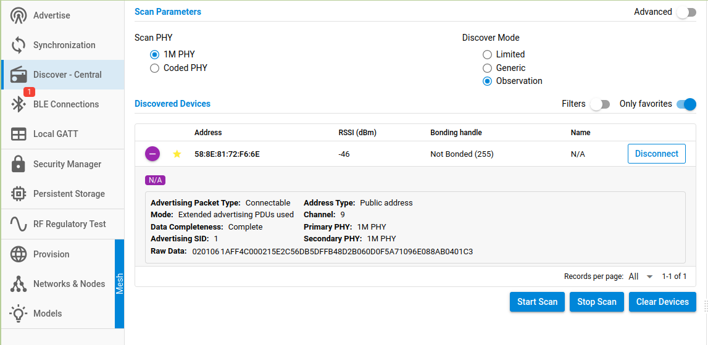

<table border="0">
  <tr>
    <td align="left" valign="middle">
    <h1>Tutorial: Matter Multi BLE Advertisement</h1>
  </td>
  <td align="left" valign="middle">
    <a href="https://www.silabs.com/wireless/matter">
      
    </a>
     <a href="https://www.silabs.com/wireless/matter">
      
  </td>
  </tr>
</table>

# Matter Multi BLE Advertisement #


## Summary ##

This tutorial will show you how to implement multi-BLE advertising within a Matter Light over Thread application. This is done using the Gecko SDK with Simplicity Studio v5 (SSv5) for ThunderBoard Sense 2 (BRD4166A).

## Gecko SDK version ##

- Gecko SDK version 4.2.1 
- Silicon Labs Matter Extension 1.0.3

## Hardware Required ##

- a PC with Simplicity Studio v5 installed.
- 1 x Silabs Thunderboard Sense 2 (TBS2 -- BRD4166A) for the light multi ble advertising application.
- 1 x Silabs Thunderboard Sense 2 (TBS2 -- BRD4166A) or any board for the Bluetooth - NCP image.

## Connections Required ##

- Micro USB for TBS2/PC

<!--## Prerequisites ##-->

## Step 1: Create a Matter Light project ##

In this tutorial, I will use the Matter Light over Thread example project as a starting point. To create a new Matter project, do the following steps:

- In the Project Explorer, right-click and choose "New Silicon Labs Project Wizard".
- Click Next, find "Matter - Light over Thread project".
- Click Next and Finish.
- Build this project by click the **Build** icon or **"Ctrl B"**.

## Step 2: Add code into BLEManagerImpl.cpp ##

In this step, we will add some snippets of code for the second ble advertisement into the **BLEManagerImpl.cpp** file. Its location is **"{$project_dir}/matter_1.0.3/src/platform/EFR32/BLEManagerImpl.cpp"**

Copy the code below and paste it into the proper place in **BLEManagerImpl.cpp**. 

```cpp
...
#define UINT16_TO_BYTES(n) ((uint8_t)(n)), ((uint8_t)((n) >> 8))
#define UINT16_TO_BYTE0(n) ((uint8_t)(n))
#define UINT16_TO_BYTE1(n) ((uint8_t)((n) >> 8))
static uint8_t handle_ibeacon;
void bcnSetupAdvBeaconing(void)
{
  sl_status_t sc;

  /* This function sets up a custom advertisement package according to iBeacon specifications.
   * The advertisement package is 30 bytes long. See the iBeacon specification for further details.
   */

  static struct
  {
    uint8_t flagsLen;    /* Length of the Flags field. */
    uint8_t flagsType;   /* Type of the Flags field. */
    uint8_t flags;       /* Flags field. */
    uint8_t mandataLen;  /* Length of the Manufacturer Data field. */
    uint8_t mandataType; /* Type of the Manufacturer Data field. */
    uint8_t compId[2];   /* Company ID field. */
    uint8_t beacType[2]; /* Beacon Type field. */
    uint8_t uuid[16];    /* 128-bit Universally Unique Identifier (UUID). The UUID is an identifier for the company using the beacon*/
    uint8_t majNum[2];   /* Beacon major number. Used to group related beacons. */
    uint8_t minNum[2];   /* Beacon minor number. Used to specify individual beacons within a group.*/
    uint8_t txPower;     /* The Beacon's measured RSSI at 1 meter distance in dBm. See the iBeacon specification for measurement guidelines. */
  } bcnBeaconAdvData = {
      /* Flag bits - See Bluetooth 4.0 Core Specification , Volume 3, Appendix C, 18.1 for more details on flags. */
      2,           /* length  */
      0x01,        /* type */
      0x04 | 0x02, /* Flags: LE General Discoverable Mode, BR/EDR is disabled. */

      /* Manufacturer specific data */
      26,   /* length of field*/
      0xFF, /* type of field */
      /* The first two data octets shall contain a company identifier code from
       * the Assigned Numbers - Company Identifiers document */
      /* 0x004C = Apple */
      {UINT16_TO_BYTES(0x004C)},

      /* Beacon type */
      /* 0x0215 is iBeacon */
      {UINT16_TO_BYTE1(0x0215), UINT16_TO_BYTE0(0x0215)},

      /* 128 bit / 16 byte UUID */
      {0xE2, 0xC5, 0x6D, 0xB5, 0xDF, 0xFB, 0x48, 0xD2, 0xB0, 0x60, 0xD0, 0xF5, 0xA7, 0x10, 0x96, 0xE0},

      /* Beacon major number */
      /* Set to 34987 and converted to correct format */
      {UINT16_TO_BYTE1(34987), UINT16_TO_BYTE0(34987)},

      /* Beacon minor number */
      /* Set as 1025 and converted to correct format */
      {UINT16_TO_BYTE1(1025), UINT16_TO_BYTE0(1025)},

      /* The Beacon's measured RSSI at 1 meter distance in dBm */
      /* 0xC3 is -61dBm */
      0xC3};

  uint8_t len = sizeof(bcnBeaconAdvData);
  uint8_t *pData = (uint8_t *)(&bcnBeaconAdvData);

  /* Set custom advertising data */
  sc = sl_bt_advertiser_create_set(&handle_ibeacon);

  sl_bt_extended_advertiser_set_data(handle_ibeacon, len, pData);

  /* Set 8 dBm Transmit Power */
  sl_bt_advertiser_set_tx_power(handle_ibeacon, 80, NULL);

  /* Set advertising parameters. 200ms (320/1.6) advertisement interval. All channels used.
   * The first two parameters are minimum and maximum advertising interval, both in
   * units of (milliseconds * 1.6).  */
  sc = sl_bt_advertiser_set_timing(handle_ibeacon, 320, 320, 0, 0);

  /* Start advertising in user mode */
  sc = sl_bt_extended_advertiser_start(handle_ibeacon, sl_bt_extended_advertiser_connectable, 0);
}
...
```

When you paste the code into the file, there is a warning notifying you are editing a shared file in the SDK. Select the **"Make a Copy"** option and continue.
After that, copy the implementation of **bcnSetupAdvBeaconing()** function and paste it into **BLEManagerImpl::StartAdvertising(void)** function as below:

```cpp
  ...
    sl_bt_advertiser_set_configuration(advertising_set_handle, 1);
    ret = sl_bt_legacy_advertiser_start(advertising_set_handle, connectableAdv);
    ChipLogProgress(DeviceLayer, "Close - Start BLE advertissement");
    if (SL_STATUS_OK == ret)
    {
        if (mFlags.Has(Flags::kFastAdvertisingEnabled))
        {
            StartBleAdvTimeoutTimer(CHIP_DEVICE_CONFIG_BLE_ADVERTISING_INTERVAL_CHANGE_TIME);
        }
        mFlags.Set(Flags::kAdvertising);
    }
    err = MapBLEError(ret);

    ChipLogProgress(DeviceLayer, "First connectable advertising set started. \r\n");
    bcnSetupAdvBeaconing();
    ChipLogProgress(DeviceLayer, "Second non-connectable advertising set started. \r\n");

exit:
    return err;
  ...
```

## Step 3: Change the number of maximum advertising concurrences  ##

To enable multiple advertising, the `Max number of advertisers reserved for user` value in **Bluetooth Core** should be set greater than one. The default value is 1. To do that, follow below instructions:


Within **Advertising Base Feature**, in the General section, set the number of "Max number of advertising sets..." to 2.


Finally, build the application again and flash it into the device.

## Step 4: Check the second advertiserment with a Bluetooth NCP Commander ##

We can check the second BLE data packets once again by using **Bluetooth NCP Commander** on SSv5. You need to build and flash a **"Bluetooth - NCP image"** into the other board, plug it into the PC. Open the **Bluetooth NCP Commander** and connect it to the device. You can follow instructions below:


Choose the proper configuration then click **Select Serial**.

After that, follow the instructions below:


You can see the second BLE advertisement appearance on the screen. Connect to this device and then go back to the Discover screen, you can still see the second BLE advertisement.

