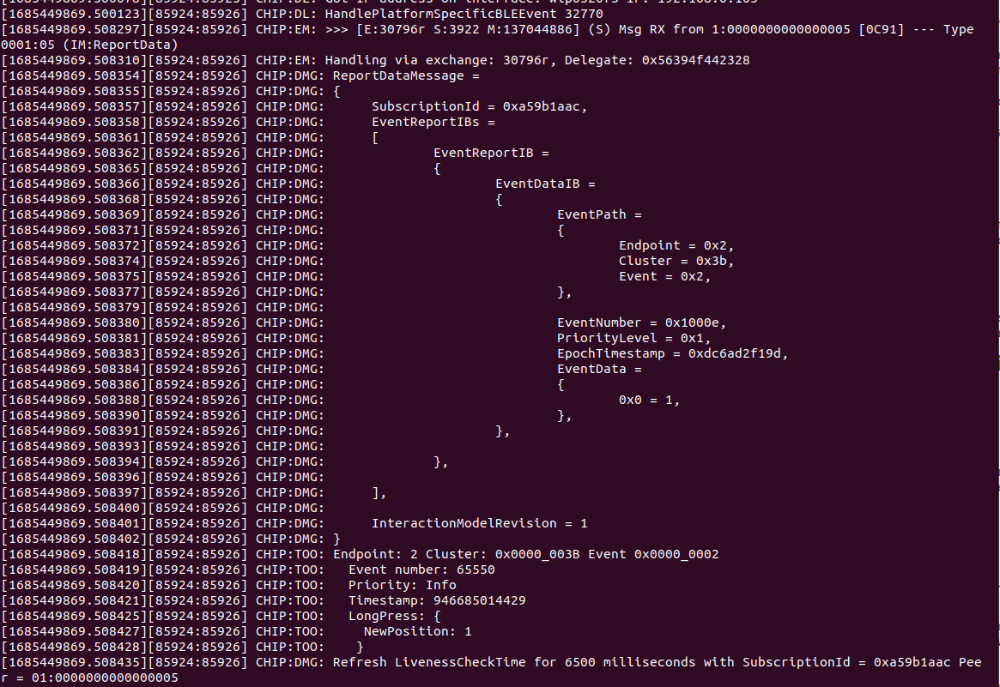

<table border="0">
  <tr>
    <td align="left" valign="middle">
    <h1>Tutorial: Matter over OpenThread Multi-feature Button</h1>
  </td>
  <td align="left" valign="middle">
    <a href="https://www.silabs.com/wireless/matter">
      
    </a>
     <a href="https://www.silabs.com/wireless/matter">
      
  </td>
  </tr>
</table>

# Multi-feature button MAD #


## Silicon Labs Matter Github version ##

[Release_2.1.0-1.1](https://github.com/SiliconLabs/matter/tree/release_2.1.0-1.1)

## Hardware Required ##

- 2 development kits in [Matter Over Thread Accessory Device Requirements](https://siliconlabs.github.io/matter/2.1.0-1.1/general/HARDWARE_REQUIREMENTS.html#matter-over-thread-accessory-device-requirements)
- An OpenThread Border Router (OTBR) such as [a Silabs Matter Hub](https://siliconlabs.github.io/matter/2.1.0-1.1/thread/RASPI_IMG.html#), an Apple HomePod mini, or a Google Nest Hub gen 2, etc.

## Overview ##

This tutorial will show you how to create and build a general Matter switch app that can trigger multiple types of events using a single button. This is based on the Silicon Labs Matter Github (SMG) repository's existing light-switch app. 

For the demonstration purpose, I will use 2 x [EFR32xG24 Wireless 2.4 GHz +10 dBm Radio Board (BRD4186C)](https://www.silabs.com/development-tools/wireless/xg24-rb4186c-efr32xg24-wireless-gecko-radio-board?tab=overview) and [EFR32 Wireless Starter Kit (WSTK) Mainboard (BRD4001A)](https://www.silabs.com/development-tools/wireless/efr32xg24-pro-kit-10-dbm?tab=overview), one for the switch and the other for the light. You can use any eligible listed in the hardware required section.

Events that this button can trigger are:
- Short press
- Short release
- Long press
- Long release
- Multi press

To simplify the experience and provide a resource to check against, we will be providing a completed multi-feature-switch project, which is the "light-switch-app" folder. Following this tutorial would create the exact same project. 

## Prerequisites ##

There have two button on the main board already, button 0 for reset factory purpose and button 1 for generic purpose. Additional event generation will apply to button 1 only, as it is used by the original light switch application.

For testing, you might need an OTBR like a Silabs Matter Hubs to commission the device and subcribe to the events. For more information on how to make a Matter Hub, you can refer to [Silicon Labs Matter Table of Contents](https://github.com/SiliconLabs/matter/blob/release_2.1.0-1.1/docs/silabs/README.md) at section 4 - Matter Over Thread. You also can use an Apple HomePod mini with the latest firmware and an iPhone running iOS 16.5 to control the light using the multi feature switch.

## Step 0: Build the default example light-switch-app  ##

First, make sure that our repo is clear and you can build an example project normally. Within the Matter directory, run the following commands. Replace the parameter `BRD4186C` with your board name.

`
$ source ./scripts/bootstrap.sh
`

`
$ ./scripts/examples/gn_efr32_example.sh examples/light-switch-app/silabs/efr32/ out/light-switch-app/ BRD4186C "chip_detail_logging=false chip_automation_logging=false"
`

## Step 1: Modify the device data model ##

Modify the ZAP file to fulfill our requirement. Run the ZAP tool by running the following command:

`
$ ./scripts/tools/zap/run_zaptool.sh examples/light-switch-app/light-switch-common/light-switch-app.zap
`

Then modify it as follows. After that, save the file and close the ZAP tool.


## Step 2: Add 2 additional source files: app_button_feature.cpp and app_button_feature.h ##

Next, we add the app_button_feature.cpp file into the `src` folder and the app_button_feature.h file into the `include` folder.

**app_button_feature.cpp**

```cpp
#include "app_button_feature.h"
#include "sl_sleeptimer.h"

#include "sl_simple_button.h"
#include "sl_simple_button_instances.h"

#include "AppTask.h"
#include <FreeRTOS.h>

typedef struct {
    uint32_t timestamp;
    uint8_t state;
    uint8_t longPressCheck = false;
    uint8_t presscount = 0;
} button_state_t;

TimerHandle_t sLongPress;
TimerHandle_t sMultiPress;

static button_state_t buttons[SL_SIMPLE_BUTTON_COUNT];

const char *str[] = {
    "inital press",
    "short release",
    "long press",
    "long release",
    "very long release",
    "multi press ongoing",
    "multi press complete"
};

void LongPressEventHandler(xTimerHandle xTimer) {

    uint8_t i = 1; // Handle for sl_button_btn1
    if (buttons[i].longPressCheck == true &&
        sl_button_get_state(SL_SIMPLE_BUTTON_INSTANCE(i)) == SL_SIMPLE_BUTTON_PRESSED) {
        buttons[i].state = APP_BUTTON_FEATURE_LONG_PRESSED;
        
        buttons[i].longPressCheck = false;
        AppTask::GetAppTask().ButtonEventHandler(SL_SIMPLE_BUTTON_INSTANCE(i), buttons[i].state);
    }
}

void MultiPressEventHandler(xTimerHandle xTimer) {

    uint8_t i = 1; // Handle for sl_button_btn1
    if (buttons[i].presscount > 0) {
        buttons[i].state = APP_BUTTON_FEATURE_MULTI_PRESS_COMPLETE;
        
        SILABS_LOG("MULTI_PRESS_COMPLETE---> btn %d: state: %s, presscount: %d",i , str[buttons[i].state],
                                                                    buttons[i].presscount);
        AppTask::GetAppTask().customButtonEventHandler(SL_SIMPLE_BUTTON_INSTANCE(i), buttons[i].state, buttons[i].presscount);
        buttons[i].presscount = 0;
    }
}

void app_button_feature_init(void)
{
    sLongPress = xTimerCreate("longPressTmr",// This is demo for button 1
                               pdMS_TO_TICKS(MEDIUM_PRESS_DURATION),// == default timer period (mS)
                               false,            // no timer reload (==one-shot)
                               (void *) 0,    // init timer id = light obj context
                               LongPressEventHandler // timer callback handler
                );
    if (sLongPress == NULL) {
        //SILABS_LOG(" Initialize Timer fails, Handle the error");
    }
    sMultiPress = xTimerCreate("lmultiPressTmr",// This is demo for button 1
                               pdMS_TO_TICKS(250),// == default timer period (mS)
                               false,            // no timer reload (==one-shot)
                               (void *) 0,    // init timer id = light obj context
                               MultiPressEventHandler // timer callback handler
                );
    if (sMultiPress == NULL) {
        //SILABS_LOG(" Initialize Timer fails, Handle the error");
    }
}

void sl_button_on_change(const sl_button_t * handle)
{
    uint32_t t_diff;    
    if (handle == SL_SIMPLE_BUTTON_INSTANCE(0)) {
        AppTask::GetAppTask().ButtonEventHandler(handle, sl_button_get_state(handle));
    } else { //handle == sl_button_btn1
        uint8_t i = 1;

        if (sl_button_get_state(handle) == SL_SIMPLE_BUTTON_PRESSED) {
            buttons[i].timestamp = sl_sleeptimer_get_tick_count();
            buttons[i].state = APP_BUTTON_FEATURE_INITIAL_PRESSED;
            buttons[i].longPressCheck = true;
            buttons[i].presscount += 1;

            // timer for long press and multi press 
            if (xTimerStart(sLongPress, 0)!=pdPASS) 
            {
                //SILABS_LOG(" Start Timer fails, Handle the error");
            }
            if (xTimerStart(sMultiPress, 0)!=pdPASS) 
            {
                //SILABS_LOG(" Start Timer fails, Handle the error");
            }

        } else if (sl_button_get_state(handle) == SL_SIMPLE_BUTTON_RELEASED) {
            t_diff = sl_sleeptimer_get_tick_count() - buttons[i].timestamp;
            
            if (t_diff < sl_sleeptimer_ms_to_tick(SHORT_PRESS_DURATION)) {
                buttons[i].state = APP_BUTTON_FEATURE_SHORT_RELEASED;
                xTimerStop(sLongPress, 0);
            } 
            else if (t_diff < sl_sleeptimer_ms_to_tick(LONG_PRESS_DURATION)) {
                buttons[i].state = APP_BUTTON_FEATURE_LONG_RELEASED;
            } else {
                buttons[i].state = APP_BUTTON_FEATURE_VERY_LONG_RELEASED;
                // if we dont handle very long released event, comment it.
                //buttons[i].state = APP_BUTTON_FEATURE_LONG_RELEASED;
            }
        }

        AppTask::GetAppTask().ButtonEventHandler(handle, buttons[i].state);
    }
}

```

**app_button_feature.h**
```cpp
#ifndef APP_BUTTON_FEATURE_H_
#define APP_BUTTON_FEATURE_H_

#ifdef __cplusplus
extern "C" {
#endif

#define APP_BUTTON_FEATURE_INITIAL_PRESSED          0
#define APP_BUTTON_FEATURE_SHORT_RELEASED           1
#define APP_BUTTON_FEATURE_LONG_PRESSED             2
#define APP_BUTTON_FEATURE_LONG_RELEASED            3
#define APP_BUTTON_FEATURE_VERY_LONG_RELEASED       4
#define APP_BUTTON_FEATURE_MULTI_PRESS_ONGOING      5
#define APP_BUTTON_FEATURE_MULTI_PRESS_COMPLETE     6

#define MULTI_PRESS_DURATION (100)
#define SHORT_PRESS_DURATION (500)
#define MEDIUM_PRESS_DURATION (1000)
#define LONG_PRESS_DURATION  (3000)

void app_button_feature_init(void);

#ifdef __cplusplus
}
#endif

#endif 

```


## Step 3: Modify main.cpp ##

In this step, we need to comment out the `sl_button_on_change` function, because we need it on `app_button_feature.cpp` to handle the press button events.

```cpp
...
...
    SILABS_LOG("Starting App Task");
    if (AppTask::GetAppTask().StartAppTask() != CHIP_NO_ERROR)
        appError(CHIP_ERROR_INTERNAL);

    SILABS_LOG("Starting FreeRTOS scheduler");
    sl_system_kernel_start();

    // Should never get here.
    chip::Platform::MemoryShutdown();
    SILABS_LOG("vTaskStartScheduler() failed");
    appError(CHIP_ERROR_INTERNAL);
}

// #ifdef SL_CATALOG_SIMPLE_BUTTON_PRESENT
// void sl_button_on_change(const sl_button_t * handle)
// {
//     AppTask::GetAppTask().ButtonEventHandler(handle, sl_button_get_state(handle));
// }
// #endif // SL_CATALOG_SIMPLE_BUTTON_PRESENT
```

## Step 4: Modify the source file AppTask.cpp ##

There are three things we need to do in this step:

**1. Include the `app_button_feature.h` header file**
```cpp
...
#include <setup_payload/QRCodeSetupPayloadGenerator.h>
#include <setup_payload/SetupPayload.h>

#include <app/clusters/identify-server/identify-server.h>

#include "app_button_feature.h"
...
```

**2. Add the `app_button_feature_init` function into `AppTask::Init()`**
```cpp
...
CHIP_ERROR AppTask::Init()
{
    CHIP_ERROR err = CHIP_NO_ERROR;
#ifdef DISPLAY_ENABLED
    GetLCD().Init((uint8_t *) "Light Switch");
#endif

    err = BaseApplication::Init(&gIdentify);
    if (err != CHIP_NO_ERROR)
    {
        SILABS_LOG("BaseApplication::Init() failed");
        appError(err);
    }

    err = LightSwitchMgr::GetInstance().Init(kLightSwitchEndpoint, kGenericSwitchEndpoint);
    if (err != CHIP_NO_ERROR)
    {
        SILABS_LOG("LightSwitchMgr Init failed!");
        appError(err);
    }
    app_button_feature_init();

    return err;
}
...
```

**3. Replace the `SwitchActionEventHandler` function because we have more events to be handled**
```cpp
...
void AppTask::SwitchActionEventHandler(AppEvent * aEvent)
{
    VerifyOrReturn(aEvent->Type == AppEvent::kEventType_Button);

    static bool mCurrentButtonState = false;

    if (aEvent->ButtonEvent.Action == SL_SIMPLE_BUTTON_PRESSED)
    {
        mCurrentButtonState = !mCurrentButtonState;
        LightSwitchMgr::LightSwitchAction action =
            mCurrentButtonState ? LightSwitchMgr::LightSwitchAction::On : LightSwitchMgr::LightSwitchAction::Off;

        LightSwitchMgr::GetInstance().TriggerLightSwitchAction(action);
        LightSwitchMgr::GetInstance().GenericSwitchOnInitialPress();

#ifdef DISPLAY_ENABLED
        sAppTask.GetLCD().WriteDemoUI(mCurrentButtonState);
#endif
    }
    else if (aEvent->ButtonEvent.Action == SL_SIMPLE_BUTTON_RELEASED)
    {
        LightSwitchMgr::GetInstance().GenericSwitchOnShortRelease();
    }
    else if (aEvent->ButtonEvent.Action == APP_BUTTON_FEATURE_LONG_PRESSED)
    {
        LightSwitchMgr::GetInstance().GenericSwitchOnLongPress();
    }
    else if (aEvent->ButtonEvent.Action == APP_BUTTON_FEATURE_LONG_RELEASED ||
            aEvent->ButtonEvent.Action == APP_BUTTON_FEATURE_VERY_LONG_RELEASED)
    {
        LightSwitchMgr::GetInstance().GenericSwitchOnLongRelease();
    }
    else if (aEvent->ButtonEvent.Action == APP_BUTTON_FEATURE_MULTI_PRESS_COMPLETE)
    {
        LightSwitchMgr::GetInstance().GenericSwitchMultiPressComplete(aEvent->pressCount);
    }
}
...
```

Because we need to send the number of presses in the multi press event, you need to create a particular function. We create a function called `customButtonEventHandler` and put it at the bottom of `AppTask.cpp`. Here, we use the variable `pressCount` to store the number of presses.

```cpp
...
#endif // SL_CATALOG_SIMPLE_BUTTON_PRESENT

void AppTask::customButtonEventHandler(const sl_button_t * buttonHandle,
                                       uint8_t btnAction,
                                       uint8_t pressCount)
{
    VerifyOrReturn(buttonHandle != NULL);

    AppEvent button_event           = {};
    button_event.Type               = AppEvent::kEventType_Button;
    button_event.ButtonEvent.Action = btnAction;
    button_event.pressCount         = pressCount;

    if (buttonHandle == APP_LIGHT_SWITCH)
    {
        button_event.Handler = SwitchActionEventHandler;
        sAppTask.PostEvent(&button_event);
    }
    else if (buttonHandle == APP_FUNCTION_BUTTON)
    {
        button_event.Handler = BaseApplication::ButtonHandler;
        sAppTask.PostEvent(&button_event);
    }
}
```

Put the definition in the `AppTask.h`
```h
...
#ifdef SL_CATALOG_SIMPLE_BUTTON_PRESENT
    /**
     * @brief Event handler when a button is pressed
     * Function posts an event for button processing
     *
     * @param buttonHandle APP_LIGHT_SWITCH or APP_FUNCTION_BUTTON
     * @param btnAction button action - SL_SIMPLE_BUTTON_PRESSED,
     *                  SL_SIMPLE_BUTTON_RELEASED or SL_SIMPLE_BUTTON_DISABLED
     */
    void ButtonEventHandler(const sl_button_t * buttonHandle, uint8_t btnAction) override;
#endif // SL_CATALOG_SIMPLE_BUTTON_PRESENT

    static void customButtonEventHandler(const sl_button_t * buttonHandle, uint8_t btnAction, uint8_t pressCount);
    ...
```

And finaly, add the varialbe `pressCount` into `AppEvent.h`

```h
...
...
        struct
        {
            uint8_t Action;
            int32_t Actor;
        } LightEvent;
    };

    uint8_t pressCount;

    EventHandler Handler;
};
```

## Step 5: Modify LightSwitchMgr.cpp and LightSwitchMgr.h  ##

We still need a little bit of change at `LightSwitchMgr.cpp` and `LightSwitchMgr.h`. In this step, we'll add more prototype and modify code at the function `GenericSwitchWorkerFunction`.

**LightSwitchMgr.cpp**
```cpp
...
/**
 * @brief Function that triggers a generic switch OnLongPress event
 */
void LightSwitchMgr::GenericSwitchOnLongPress()
{
    GenericSwitchEventData * data = Platform::New<GenericSwitchEventData>();

    data->endpoint = mGenericSwitchEndpoint;
    data->event    = Switch::Events::LongPress::Id;

    DeviceLayer::PlatformMgr().ScheduleWork(GenericSwitchWorkerFunction, reinterpret_cast<intptr_t>(data));
}

/**
 * @brief Function that triggers a generic switch OnLongRelease event
 */
void LightSwitchMgr::GenericSwitchOnLongRelease()
{
    GenericSwitchEventData * data = Platform::New<GenericSwitchEventData>();

    data->endpoint = mGenericSwitchEndpoint;
    data->event    = Switch::Events::LongRelease::Id;

    DeviceLayer::PlatformMgr().ScheduleWork(GenericSwitchWorkerFunction, reinterpret_cast<intptr_t>(data));
}

/**
 * @brief Function that triggers a generic switch MultiPressComplete event
 */
void LightSwitchMgr::GenericSwitchMultiPressComplete(uint8_t pressCount)
{
    GenericSwitchEventData * data = Platform::New<GenericSwitchEventData>();

    data->endpoint      = mGenericSwitchEndpoint;
    data->event         = Switch::Events::MultiPressComplete::Id;
    data->pressCount    = pressCount;

    DeviceLayer::PlatformMgr().ScheduleWork(GenericSwitchWorkerFunction, reinterpret_cast<intptr_t>(data));
}
...
```

```cpp
...
void LightSwitchMgr::GenericSwitchWorkerFunction(intptr_t context)
{
    GenericSwitchEventData * data = reinterpret_cast<GenericSwitchEventData *>(context);

    switch (data->event)
    {
    case Switch::Events::InitialPress::Id: {
        uint8_t currentPosition = 1;

        // Set new attribute value
        Clusters::Switch::Attributes::CurrentPosition::Set(data->endpoint, currentPosition);

        // Trigger event
        Clusters::SwitchServer::Instance().OnInitialPress(data->endpoint, currentPosition);
        break;
    }
    case Switch::Events::ShortRelease::Id: {
        uint8_t previousPosition = 1;
        uint8_t currentPosition  = 0;

        // Set new attribute value
        Clusters::Switch::Attributes::CurrentPosition::Set(data->endpoint, currentPosition);

        // Trigger event
        Clusters::SwitchServer::Instance().OnShortRelease(data->endpoint, previousPosition);
        break;
    }
    case Switch::Events::LongRelease::Id: {
        uint8_t previousPosition = 1;
        uint8_t currentPosition  = 0;

        // Set new attribute value
        Clusters::Switch::Attributes::CurrentPosition::Set(data->endpoint, currentPosition);

        // Trigger event
        Clusters::SwitchServer::Instance().OnLongRelease(data->endpoint, previousPosition);
        break;
    }
    case Switch::Events::LongPress::Id: {
        uint8_t currentPosition = 1;

        // Set new attribute value
        Clusters::Switch::Attributes::CurrentPosition::Set(data->endpoint, currentPosition);

        // Trigger event
        Clusters::SwitchServer::Instance().OnLongPress(data->endpoint, currentPosition);
        break;
    }
    case Switch::Events::MultiPressComplete::Id: {
        uint8_t currentPosition = 1;

        // Set new attribute value
        Clusters::Switch::Attributes::CurrentPosition::Set(data->endpoint, currentPosition);

        // Trigger event
        Clusters::SwitchServer::Instance().OnMultiPressComplete(data->endpoint, currentPosition, data->pressCount);
        break;
    }
    default:
        break;
    }

    Platform::Delete(data);
}
```

**LightSwitchMgr.h**

We add a `count` variable to keep track of the time the button is pressed in the a multi-press event.

```cpp
...
    struct GenericSwitchEventData
    {
        chip::EndpointId endpoint;
        chip::EventId event;
        uint8_t pressCount;
    };

    CHIP_ERROR Init(chip::EndpointId lightSwitchEndpoint, chip::EndpointId genericSwitchEndpoint);

    void GenericSwitchOnInitialPress();
    void GenericSwitchOnShortRelease();

    void GenericSwitchOnLongPress();
    void GenericSwitchOnLongRelease();
    void GenericSwitchMultiPressComplete(uint8_t pressCount);

    void TriggerLightSwitchAction(LightSwitchAction action, bool isGroupCommand = false);

    static LightSwitchMgr & GetInstance() { return sSwitch; }
...
```

## Step 6: Modify the GN build file ##

Add the line "src/app_button_feature.cpp" into the BUILD.gn file to compile our additional source file.

```cpp
...
silabs_executable("light_switch_app") {
  output_name = "chip-efr32-light-switch-example.out"
  include_dirs = [ "include" ]
  defines = []

  sources = [
    "${chip_root}/examples/light-switch-app/silabs/common/BindingHandler.cpp",
    "${chip_root}/examples/light-switch-app/silabs/common/LightSwitchMgr.cpp",
    "src/AppTask.cpp",
    "src/ZclCallbacks.cpp",
    "src/main.cpp",
    "src/app_button_feature.cpp",
  ]

  deps = [
    ":sdk",
    "${examples_plat_dir}:efr32-common",
    app_data_model,
  ]

  if (chip_build_libshell) {
    sources += [
      "${chip_root}/examples/light-switch-app/silabs/common/ShellCommands.cpp",
    ]
  }
...
```

## Step 7: Build and Flash the application ##

In this step, we will build and flash it into our board. Use the following commands:

**BUILD**

`$ ./scripts/examples/gn_efr32_example.sh examples/light-switch-app/silabs/efr32/ out/light-switch-app/ BRD4186C "chip_detail_logging=false chip_automation_logging=false"`

**FLASH**

To flash, we need to burn the image and the bootloader sequentially. The image is located at the `out/light-switch-app/BRD4186C` path

With the bootloader for release 2.1.0, we can download it in https://github.com/SiliconLabs/matter/releases/tag/v2.1.0-1.1 at the "Assets" section.

## Step 8: Commission your device ##

To commissioning a device into a Silabs Matter Hubs, run the following command on your RPi OTBR. The commissioned node-id in this case is 5.

`
$. mattertool startThread
`

`
$. mattertool bleThread -n 5
`

## Step 9: Monitor the device with chip-tool's interactive mode ##

To monitor an event in real time, we need to run chip-tool in the interactive mode.

`
$. mattertool interactive start
`

Next, we run the command to subscribe to the event we want to catch. There are many events you can try to catch.

- initial-press                                                        
- long-press
- short-release
- long-release
- multi-press-ongoing     
- multi-press-complete  

`
$. switch subscribe-event initial-press 1 5 5 2
`

Here is what happens when I hold down button 1




Here is what happens when I double click/press button 1


## Step 10: Interaction with the Apple ecosystem ##

In this demo, I will create a Matter light over Thread device. Ater that, I commission both the switch and the light with an Apple HomePod mini.

First, I compile the Matter light and flash it similar to the switch.
`
$ ./scripts/examples/gn_efr32_example.sh examples/lighting-app/silabs/efr32/ out/lighting-app BRD4186C "chip_detail_logging=false chip_automation_logging=false"
`
Then, I commission and bind them as below:

- Single press action


- Double press action


Finally, We can control the lighting device by the single pressing and double pressing the button 1 on the development kit.