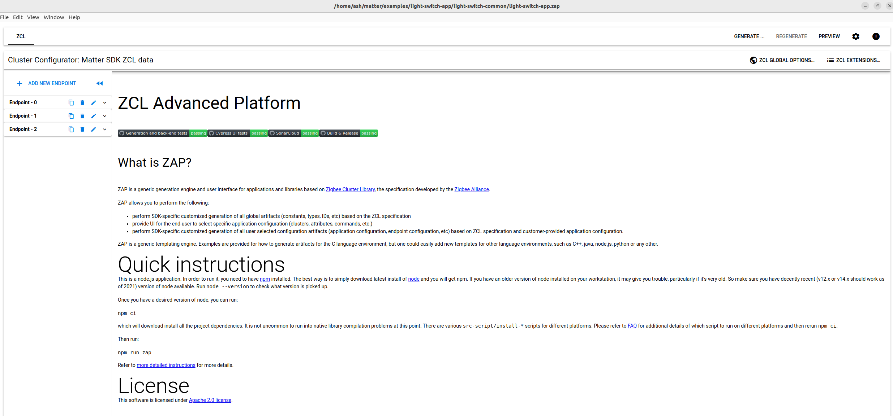
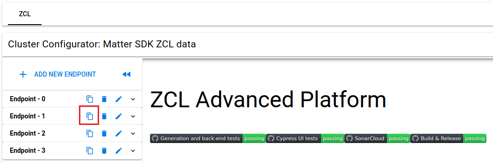
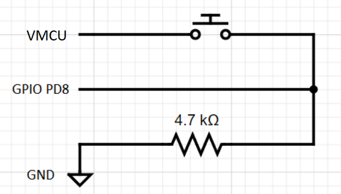

<table border="0">
  <tr>
    <td align="left" valign="middle">
    <h1>Tutorial: Matter over OpenThread Multi Switch Device</h1>
  </td>
  <td align="left" valign="middle">
    <a href="https://www.silabs.com/wireless/matter">
      
    </a>
     <a href="https://www.silabs.com/wireless/matter">
      
  </td>
  </tr>
</table>

# Multi switch MAD #


## Summary ##

This tutorial will show you how to create and build a multi switch app (multi switch Matter Accessory Device) from the Silicon Labs Matter Github (SMG) repository's existing light-switch app.

## Silicon Labs Matter Github version ##

release_1.0.0

## Hardware Required ##

- Raspberry Pi 4 using the Matter Hub Raspberry Pi Image
- 1 x Silabs Thunderboard Sense 2 (TBS2 -- BRD4166A)
- 1 eligible board capable of running the light switch app. Refer to [Matter over Thead Light Switch](https://github.com/SiliconLabs/matter/tree/release_1.0.0/examples/light-switch-app)
- 2 eligible boards capable of running the lighting app. Refer to [Matter over Thead Lighting App](https://github.com/SiliconLabs/matter/blob/release_1.0.0/examples/lighting-app/efr32/README.md)

## Connections Required ##
 
- Ethernet or Wi-Fi for Raspberry Pi
- Micro USB for TBS2/Raspberry Pi
- Micro USB for other Silabs development kits

## Overview ##

You have already built and interacted with the Light Switch App on a Thread network. This tutorial is the next step; using the existing Light Switch App and modifying it to add features (in this case additional endpoints).

We will be modifying the Light Switch app, using the ZAP tool to configure the endpoints, clusters and attributes, and then adding code to make it all work. 

A multi switch device is a device (in this case a Matter Accessory Device) that contains 2 or more switches controlling other Matter devices in the same Matter network (one device per switch). This application is extended from the light switch app which contains only one switch.

This tutorial aims at people who have gone through the light switch example at: [Matter over Thead Light Switch](https://github.com/SiliconLabs/matter/tree/release_1.0.0/examples/light-switch-app) and want to customize/extend your application.

To simplify the experience and provide a resource to check against, we will be providing a completed multi switch project, which is the "light-switch-app" folder. Following this tutorial would create the exact same project.

## Prerequisites ##
This tutorial expects you to have built a MAD on your local setup, following either:
- The [Lab Manual and updates](https://community.silabs.com/s/article/MAT-301-Lab-Update-Works-With-2022?language=en_US) from the Silicon Labs WorksWith2022 MAT-301 seminar

or:

- The guides found in SMG:
    - [Matter over Thead demo overview](https://github.com/SiliconLabs/matter/blob/release_0.3.0/docs/silabs/thread/DEMO_OVERVIEW.md)
    - [Matter over Thead Light Switch](https://github.com/SiliconLabs/matter/tree/release_1.0.0/examples/light-switch-app)
    - [Creating a custom application](https://github.com/SiliconLabs/matter/blob/release_0.4.0/silabs_examples/template/efr32/HOW_TO_CREATE_A_CUSTOM_APP.md)
- The **RaspberryPi OTBR .img** and **RCP** ***must_ be from SMG 0.1.0*** for this tutorial

***Note:** While the build in the tutorial was done entirely with the Linux console, this tutorial involves the Ubuntu GUI. However, the only component that **requires** the Linux or Mac GUI is the **ZAP tool**. Without ZAP tool, you cannot modify the Endpoints/clusters of your MAD.*


***Note:** Unless otherwise specified, the commands in the tutorial are run from inside the directory of the cloned Silabs Matter repository, eg. **~/matter$**.*


- Silicon Labs Matter repository: You should already have the SiliconLabs Matter repository with submodules, but you may be on a prior version. If so, check out the current version tag seen in [SMG](https://github.com/SiliconLabs/matter):  
   `$ git fetch`  
   `$ git checkout release_1.0.0`  
   You may need to stash any changes you've made in the prior version:
   `$ git stash`  
   To avoid issues related to modification/submodules not properly checked out, you may want to clone the SiliconLabs Matter repository with its submodules:  
   `$ git clone https://github.com/SiliconLabs/matter.git`  
   `$ git checkout release_1.0.0`  
   `$ git submodule update --init --recursive`  

## Step 1: Use ZAP tool ##

Run the ZAP tool, add an endpoint to fit the application requirement and save it. 

*   Run the **ZAP tool** with the .zap file of your project as the argument:

    `$ ./scripts/tools/zap/run_zaptool.sh examples/light-switch-app/light-switch-common/light-switch-app.zap`

    ***Note:* If you do not have access to a GUI version of Ubuntu or MacOS to run ZAP, this command will fail.**

    On startup, the GUI should look like this:

    

*   Clone **Endpoint 1** from the endpoint list on the left panel by clicking the copy button. This results in endpoint 3 (a copy of endpoint 1) being created, this will be our new switch. 

     

*   Select File → Save to save the profile you just modified
*   Exit the ZAP tool

## Step 2: Generate source and header files ##

Use the newly modified .zap file to create project files:

*   Generate files:

    `$ ./scripts/tools/zap/generate.py examples/light-switch-app/light-switch-common/light-switch-app.zap -o zzz_generated/light-switch-app/zap-generated/`


## Step 3: Create a new button for our application ##

Add a new button config header file:  
**~/matter/examples/light-switch-app/efr32/include/button_btn2_config.h**

This will be the configuration for our additional button:

```cpp
#ifndef BUTTON_BTN2_CONFIG_H
#define BUTTON_BTN2_CONFIG_H

#include "em_gpio.h"
#include "sl_simple_button.h"

#define SL_SIMPLE_BUTTON_BTN2_MODE       SL_SIMPLE_BUTTON_MODE_INTERRUPT
#define SL_SIMPLE_BUTTON_BTN2_PORT       gpioPortD
#define SL_SIMPLE_BUTTON_BTN2_PIN        8

#endif // BUTTON_BTN2_CONFIG_H
```

Add a new button instance header file:  
**~/matter/examples/light-switch-app/efr32/include/button_btn2_instance.h**

```cpp
#ifndef BUTTON_BTN2_INSTANCE_H
#define BUTTON_BTN2_INSTANCE_H

#include "sl_simple_button.h"

extern const sl_button_t sl_button_btn2;

#endif // BUTTON_BTN2_INSTANCE_H
```

## Step 4: Add callbacks to handle button pressing events ##

Modify the file **AppTask.h** inside **~/matter/examples/light-switch-app/efr32/include/**

*   Include additional header file: **"button_btn2_instance.h"**
*   Modify the class **AppTask** to add handlers for button pressing events:

    Repleace this:

    ```cpp
    static void SwitchActionEventHandler(AppEvent * aEvent);
    ```
        
    With this:

    ```cpp
    static void Btn1ActionEventHandler(AppEvent * aEvent);
    static void Btn2ActionEventHandler(AppEvent * aEvent);
    ```

Modify the file **AppTask.cpp** inside **~/matter/examples/light-switch-app/efr32/src/**, implement functions to handle button pressing events.

*   Define a name for our new button:
    ```cpp
    #define APP_LIGHT_SWITCH_2 &sl_button_btn2
    ```
*   Repleace this:

    ```cpp
    bool mCurrentButtonState = false;
    ```
        
    With this:

    ```cpp
    bool CurrentButton1State = false;
    bool CurrentButton2State = false;
    ```

*   Modify and add button event handler functions, in which we will handle approprite actions for each button:
    Repleace the whole function AppTask::SwitchActionEventHandler(AppEvent * aEvent) with these functions:

    ```cpp
    void AppTask::Btn1ActionEventHandler(AppEvent * aEvent)
    {
        if (aEvent->Type == AppEvent::kEventType_Button)
        {
            BindingCommandData * data = Platform::New<BindingCommandData>();
            data->clusterId           = chip::app::Clusters::OnOff::Id;
            data->localEndpointId     = 1;

            if (CurrentButton1State)
            {
                CurrentButton1State = false;
                data->commandId     = chip::app::Clusters::OnOff::Commands::Off::Id;
            }
            else
            {
                data->commandId     = chip::app::Clusters::OnOff::Commands::On::Id;
                CurrentButton1State = true;
            }
    #ifdef DISPLAY_ENABLED
            sAppTask.GetLCD().WriteDemoUI(CurrentButton1State);
    #endif
            DeviceLayer::PlatformMgr().ScheduleWork(SwitchWorkerFunction, reinterpret_cast<intptr_t>(data));
        }
    }
    void AppTask::Btn2ActionEventHandler(AppEvent * aEvent)
    {
        if (aEvent->Type == AppEvent::kEventType_Button)
        {
            BindingCommandData * data = Platform::New<BindingCommandData>();
            data->clusterId           = chip::app::Clusters::OnOff::Id;
            data->localEndpointId     = 3;

            if (CurrentButton2State)
            {
                CurrentButton2State = false;
                data->commandId     = chip::app::Clusters::OnOff::Commands::Off::Id;
            }
            else
            {
                data->commandId     = chip::app::Clusters::OnOff::Commands::On::Id;
                CurrentButton2State = true;
            }
    #ifdef DISPLAY_ENABLED
            sAppTask.GetLCD().WriteDemoUI(CurrentButton2State);
    #endif
            DeviceLayer::PlatformMgr().ScheduleWork(SwitchWorkerFunction, reinterpret_cast<intptr_t>(data));
        }
    }
    ```

*   Handle button pressing events with their corresponding handlers:

    ```cpp
    ...
    if (buttonHandle == APP_LIGHT_SWITCH && btnAction == SL_SIMPLE_BUTTON_PRESSED)
        {
            button_event.Handler = Btn1ActionEventHandler;
            sAppTask.PostEvent(&button_event);
        }
        else if (buttonHandle == APP_LIGHT_SWITCH_2 && btnAction == SL_SIMPLE_BUTTON_PRESSED)
        {
            button_event.Handler = Btn2ActionEventHandler;
            sAppTask.PostEvent(&button_event);
        }
        else if (buttonHandle == APP_FUNCTION_BUTTON)
        {
            button_event.Handler = BaseApplication::ButtonHandler;
            sAppTask.PostEvent(&button_event);
        }
    ...
    ```

## Step 5: Add a new button instance source file: ##

**~/matter/examples/light-switch-app/efr32/src/button_btn2_instance.c**

This file will declare an instance for our addtional button.

```cpp
#include "button_btn2_instance.h"
#include "sl_simple_button.h"
#include "button_btn2_config.h"

sl_simple_button_context_t simple_btn2_context = {
  .state = 0,
  .history = 0,
  .port = SL_SIMPLE_BUTTON_BTN2_PORT,
  .pin = SL_SIMPLE_BUTTON_BTN2_PIN,
  .mode = SL_SIMPLE_BUTTON_BTN2_MODE,
};

const sl_button_t sl_button_btn2 = {
  .context = &simple_btn2_context,
  .init = sl_simple_button_init,
  .get_state = sl_simple_button_get_state,
  .poll = sl_simple_button_poll_step,
  .enable = sl_simple_button_enable,
  .disable = sl_simple_button_disable,
};

void button_btn2_init_instance()
{
  sl_button_init(&sl_button_btn2);
}
```

## Step 6: Set up Initialization function for your new button ##

Modify the file **main.cpp** inside **~/matter/examples/light-switch-app/efr32/src/**

*   Add a prototype for your initialization function: 

    ```cpp
    extern "C" void button_btn2_init_instance();
    ```

*   Run your initiazation function:

    ```cpp
    ...
    init_efrPlatform();
    /* Initialize button 2 */
    button_btn2_init_instance();
    
    if (EFR32MatterConfig::InitMatter(BLE_DEV_NAME) != CHIP_NO_ERROR)
        appError(CHIP_ERROR_INTERNAL);
    ...
    ```

## Step 7: Modify the GN build file ##

Modify the file **BUILD.gn** inside **~/matter/examples/light-switch-app/efr32** to include the source file changes:

```cpp
...
efr32_executable("multi-light_switch_app") {
  output_name = "multi-light-switch-example.out"
  include_dirs = [ "include" ]
  defines = []

  sources = [
    "${examples_plat_dir}/BaseApplication.cpp",
    "${examples_plat_dir}/efr32_utils.cpp",
    "${examples_plat_dir}/heap_4_silabs.c",
    "${examples_plat_dir}/init_efrPlatform.cpp",
    "${examples_plat_dir}/matter_config.cpp",
    "src/AppTask.cpp",
    "src/ZclCallbacks.cpp",
    "src/binding-handler.cpp",
    "src/button_btn2_instance.c",
    "src/main.cpp",
  ]
...
group("efr32") {
  deps = [ ":multi-light_switch_app" ]
}
...
```

## Step 8: Build the project ##

From the **matter** folder, run:

`$ ./scripts/examples/gn_efr32_example.sh examples/light-switch-app/efr32/ ./out/light-switch <Your board name>`

Remember to specify your board name in the build command, for example: BRD4161A

## Step 9: Setup your physical button ##

Setup your new button according to this schematic, you may use GPIOs on the expansion header for ease. Note that this GPIO must match the configuration in button_btn2_config.h.



## Step 10: Flash the firmware ##

Flash the binary file located at **out/light-switch/\<Your board name>/multi-light-switch-example.s37** to your development kit.

## Step 11: Commission and use the multi-switch ##

Once the firmware has been flashed onto your Matter Accessory device you can follow these steps to run the multi-switch application:

* Power off your multi switch board
* Flash two other boards with the lighting application and turn them on
* Commision these two lighting Matter devices with your OTBR, note that 31670 and 31671 will be their node IDs:
  * $ mattertool pairing ble-thread 31670 hex:\<your thread dataset> 20202021 3840
  * $ mattertool pairing ble-thread 31671 hex:\<your thread dataset> 20202021 3840
* Power on your multi switch board
* Commision the Matter multi switch with your OTBR, note that 31676 will be the node ID for your multi-switch:
  * $ mattertool pairing ble-thread 31676 hex:\<your thread dataset> 20202021 3840
* Use the mattertool to add the proper ACL for the light devices, this will write ACL to the accesscontrol clusters:
  * $ mattertool accesscontrol write acl '[{"fabricIndex": 1, "privilege": 5, "authMode": 2, "subjects": [112233], "targets": null}, {"fabricIndex": 1, "privilege": 3, "authMode": 2, "subjects": [31676], "targets": [{"cluster": 6, "endpoint": 1, "deviceType": null}, {"cluster": 8, "endpoint": 1, "deviceType": null}]}]' 31670 0
  * $ mattertool accesscontrol write acl '[{"fabricIndex": 1, "privilege": 5, "authMode": 2, "subjects": [112233], "targets": null}, {"fabricIndex": 1, "privilege": 3, "authMode": 2, "subjects": [31676], "targets": [{"cluster": 6, "endpoint": 1, "deviceType": null}, {"cluster": 8, "endpoint": 1, "deviceType": null}]}]' 31671 0
* Bind the light from each lighting device to the endpoint (switch) controlling it:
  * $ mattertool binding write binding '[{"fabricIndex": 1, "node": 31670, "endpoint": 1, "cluster": 6}, {"fabricIndex": 1, "node": 31670, "endpoint": 1, "cluster": 8}]' 31676 1
  * $ mattertool binding write binding '[{"fabricIndex": 1, "node": 31671, "endpoint": 1, "cluster": 6}, {"fabricIndex": 1, "node": 31671, "endpoint": 1, "cluster": 8}]' 31676 3
* Control each individual light using their according buttons.
