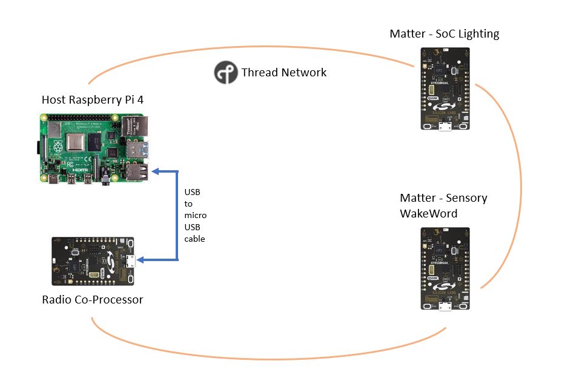
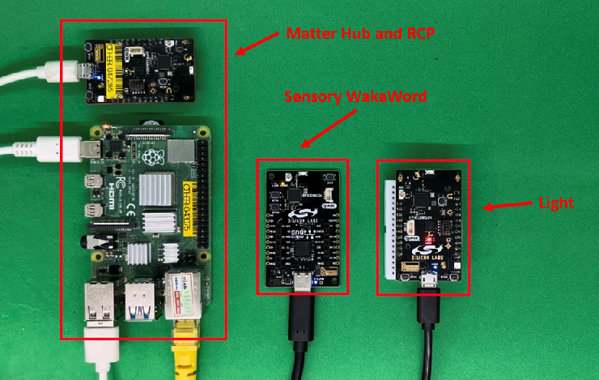
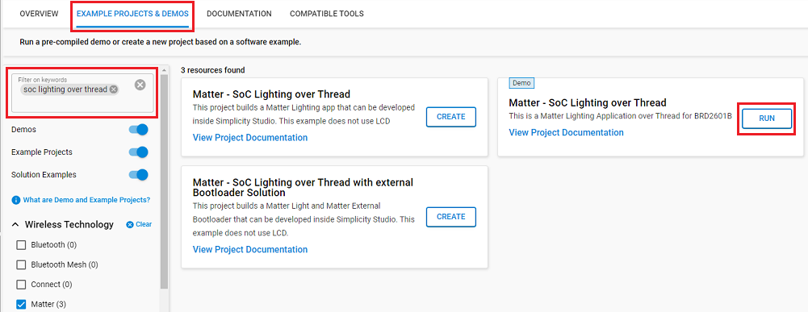
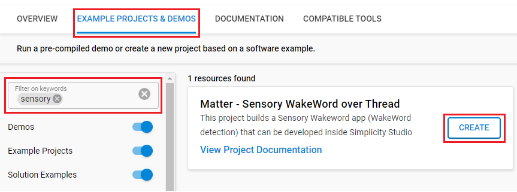
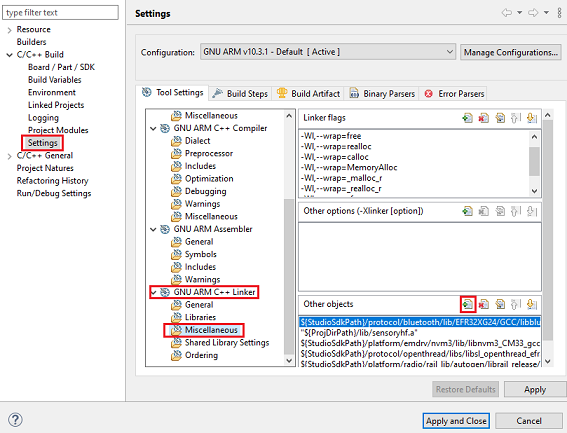
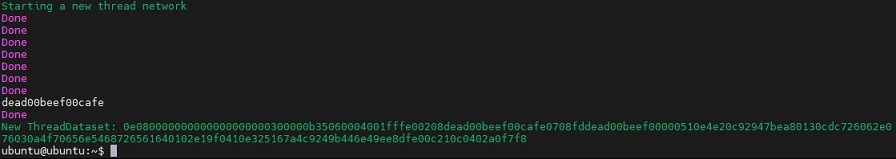
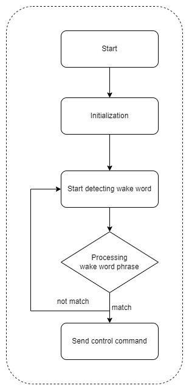

# Matter - Sensory WakeWord detection over Thread #


## Summary ##

This tutorial shows you how to create and build an SoC Sensory Wakeword application (Wake Word detection) via Gecko SDK and Matter SDK Extension from Silicon Labs. This project allows you to control an LED on another MAD (Matter Accessory Device) by your voice. For example, if you say "Gecko On", it turns on the LED, while "Gecko Off" turns it off.



## Gecko SDK version ##

- GSDK v4.3.2
- Silicon Labs Matter Extension v2.1.1

**Note:** This project uses the words "Gecko On" and "Gecko Off" to control the state of LED, you can customize the words on your own. Accessing Sensory VoiceHub (https://voicehub.sensory.com/) for more information.

## Hardware Required ##

- One Raspberry Pi 4 running the Matter Hub Raspberry Pi Image
- One board capable of running as the Radio Co-Processor(RCP)
- [One xG24-DevKit (BRD2601B)](https://www.silabs.com/development-tools/wireless/efr32xg24-dev-kit?tab=overview)
- One eligible board capable of running **Matter - SoC Lighting over Thread**.

## Connections Required ##



## Setup ##

### Setting up the Matter Hub (Raspberry Pi) ###

The Matter Hub consists of the Open Thread Border Router (OTBR) and the chip-tool running on a Raspberry Pi. Silicon Labs has developed a Raspberry Pi image combining the OTBR and chip-tool that can be downloaded from [Matter Artifacts page](https://docs.silabs.com/matter/1.0.5/matter-thread/prerequisites-artifacts).

### Flash the RCP ###

The Radio Co-Processor (RCP) is a Thread device that connects to the Raspberry Pi via USB. You can use the Simplicity Commander to flash images for the RCP. Prebuilt RCP images are available in here: [How To Build and Flash the RCP](https://docs.silabs.com/matter/1.0.5/matter-thread/rcp).

### Running Matter - Sensory WakeWord detection over Thread ###

In this tutorial, Matter - SoC Lighting over Thread acts as the lighting device and we will use our voice to control it. You can find and run the **Matter - Sensory WakeWord detection over Thread** easily on Simplicity Studio.



**Note:**

- Make sure the [Silicon Labs Matter Extension](https://github.com/SiliconLabs/matter_extension) is already installed with your GSDK: [Preferences > Simplicity Studio > SDKs](https://github.com/SiliconLabs/third_party_hw_drivers_extension/blob/master/README.md#how-to-add-to-simplicity-studio-ide).

### Running Matter - Sensory WakeWord over Thread ###

#### Create a project based on an example project ####

1. From the Launcher Home, add your hardware to My Products, click on it, and click on the EXAMPLE PROJECTS & DEMOS tab. Find the example project with the filter "Sensory".

    

2. Click Create button on **Matter - Sensory WakeWord detection over Thread** example. Example project creation dialog pops up -> click Create and Finish and the projects will be generated.

3. Build and flash the examples to the board.

#### Start with Matter - SoC Light Switch over Thread project ####

1. Create **Matter - SoC Light Switch over Thread** project for your hardware using SimplicityStudio 5.

2. Copy all folders (common, src, model and lib folders) into the project root folder (overwriting existing).

3. Open the .slcp file. Select the SOFTWARE COMPONENTS tab and install the software components:
    - [Platform] → [Board Drivers] → [Microphone]
    - Enable the microphone in [Platform] → [Board]

4. Right clink on the project and choose properties → C/C++ build → Settings → GNU ARM C++ Linker → Miscellaneous.

    

    Add the following file path for the corresponding board:
    - "${ProjDirPath}/lib/sensoryhf.a" for series 2 board
    - "${ProjDirPath}/lib/sensory.a" for series 1 board

5. Build and flash the project.

**Note:**

- Make sure that this repository is added to [Preferences > Simplicity Studio > External Repos](https://docs.silabs.com/simplicity-studio-5-users-guide/latest/ss-5-users-guide-about-the-launcher/welcome-and-device-tabs).

- Do not forget to flash a bootloader to your board, see [Bootloader](https://github.com/SiliconLabs/bluetooth_applications/blob/master/README.md#bootloader) for more information.

### Creating Thread Network and Commissioning MADs and Binding MADs ###

After flashing all the required binaries to the corresponding hardware, you need to start a new Thread network from the local OTBR that is running on the Raspberry Pi. When the Thread network is already created, you need to commission the MADs (Matter Accessory Device) into the network. Finally, binding between the light and sensory app devices is required to complete the setup procedure. Follow these commands below to finish the network:

- Start a new Thread network:

    ```C
    mattertool startThread
    ```

    After creating Thread network successfully, you will get the result below.

    

- Commissioning Lighting device:

    ```C
    mattertool pairing ble-thread [nodeID-light] hex: [HEX] 20202021 3840
    ```

- Commissioning SensoryWakeWord dection device:

    ```C
    mattertool pairing ble-thread [nodeID-SensoryWakeWord] hex: [HEX] 20202021 3840
    ```

- Binding the Lighting and SensoryWakeWord devices together:

    ```C
    mattertool accesscontrol write acl '[ { "fabricIndex" : 1 , "privilege" : 5 , "authMode" : 2 , "subjects" : [112233] , "targets" : null } , { "fabricIndex" : 1 , "privilege" : 3 , "authMode" : 2 , "subjects" : [nodeID-SensoryWakeWord], "targets" : null }]'nodeID-light 0
    ```

    ```C
    mattertool binding write binding '[ { "fabricIndex" : 1 , "node" :nodeID-light,"endpoint" :1,"cluster" :6} ]'nodeID-SensoryWakeWord 1
    ```

    **Note:** You can choose random numbers as the nodeID for light and SensoryWakeWord, and the HEX the blue code printed out on the terminal when you created the Thread network.

## How It Works ##

### Sensory WakeWord Detection ###



### Output ###

After finishing all the above guidline, you can control the state of the LED by your voice.

- "*Gecko on*": turn on the LED
- "*Gecko off*": turn off the LED

    
