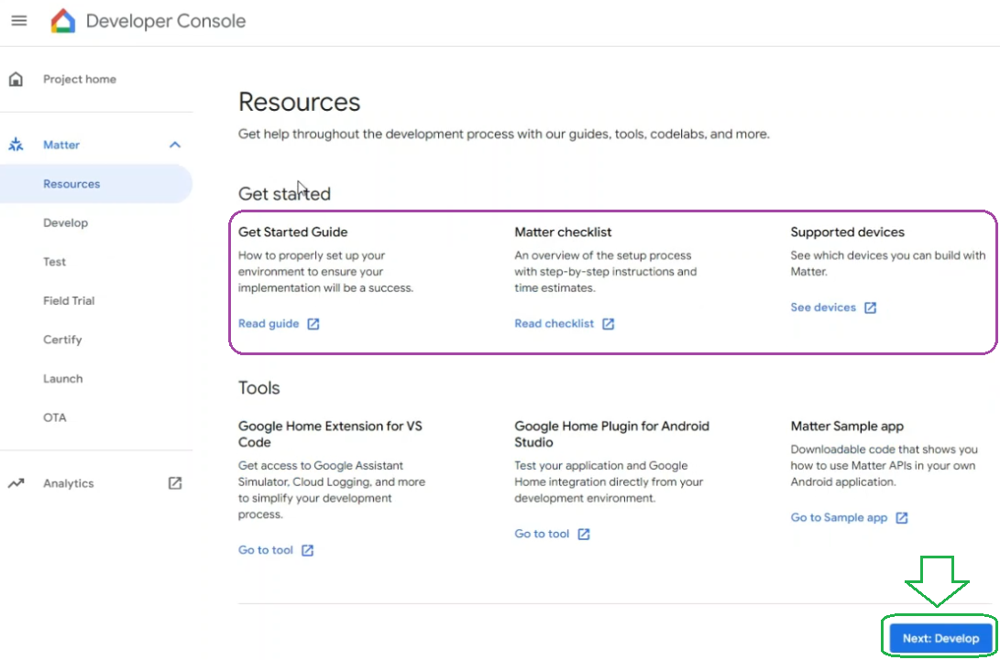

# Matter - Weather Station over Thread #


[](https://www.sparkfun.com/products/retired/13674)
[](https://www.sparkfun.com/products/15901)


## Summary ##

This project showcases how to add custom clusters to a Matter project, and how to modify Home Assistant to be able to read these custom clusters.

The project does this by utilizing a Sparkfun Weather Meter Kit, which measures Wind Speed, Direction and Rainfall Measurement, for which there are no clusters and attributes yet.

## Gecko SDK version ##

- GSDK v4.4.0
- Silicon Labs Matter Extension v2.2.0-1.2
- Third Party Hardware Drivers Extension v1.11.0

## Hardware Required ##

- One Raspberry Pi 4 running [Home Assistant OS](https://www.home-assistant.io/installation/raspberrypi) (2024.2.0 is used at the time of writing) 
- One Google Nest Hub (or any relevant OpenThread Border Router capable Matter Hub)
- One Android smartphone with both Google Home and Home Assistant applications installed
- [One xG24-Explorer Kit (BRD2703A)](https://www.silabs.com/development-tools/wireless/efr32xg24-explorer-kit?tab=overview) or any other board capable of running **Matter - SoC Sensor over Thread**
- [A SparkFun Weather Meter Kit](https://www.sparkfun.com/products/15901)
- [A Sparkfun Photon Weather Shield](https://www.sparkfun.com/products/retired/13674)

## Connections Required ##


## Setup ##

### Setting up Home Assistant (Raspberry Pi) ###

Install the **Matter Server**, and the **Advanced SSH & Web Terminal** Add-on. [Home Assistant Add-ons](https://www.home-assistant.io/addons/)
In the Next step we will add support for our custom clusters to Home Assistant.
Note that this change will not persist after a Home Assistant Core update.

- In Advanced SSH & Web Terminal Configuration set protection mode to off.
- Enter the terminal, or ssh 
- **docker ps** to see container ids
- find the CONTAINER ID for ghcr.io/home-assistant/raspberrypi4-64-homeassistant
- execute 
```
docker exec -it <CONTAINER ID> bash
```
- (optional) You can use nano to edit pyhon files in the container. To install nano execute
```
apk update
apk add nano
```
- add to: /usr/local/lib/python3.12/site-packages/matter_server/client/models/clusters.py: (using the command **nano /usr/local/lib/python3.12/site-packages/matter_server/client/models/clusters.py**)
```py
@dataclass
class WeatherStationCluster(Cluster):

    id: ClassVar[int] = 0xFFF1FEDC

    @ChipUtility.classproperty
    def descriptor(cls) -> ClusterObjectDescriptor:
        return ClusterObjectDescriptor(
            Fields=[
                ClusterObjectFieldDescriptor(
                    Label="windspeed", Tag=0x0000, Type=float32
                ),
                ClusterObjectFieldDescriptor(
                    Label="winddirection", Tag=0x0001, Type=float32
                ),
                ClusterObjectFieldDescriptor(
                    Label="rainfall", Tag=0x0002, Type=float32
                ),
            ]
        )

    windspeed: float32 | None = None
    winddirection: float32 | None = None
    rainfall: float32 | None = None

    class Attributes:

        @dataclass
        class WindSpeed(ClusterAttributeDescriptor):

            @ChipUtility.classproperty
            def cluster_id(cls) -> int:
                return 0xFFF1FEDC

            @ChipUtility.classproperty
            def attribute_id(cls) -> int:
                return 0x0000

            @ChipUtility.classproperty
            def attribute_type(cls) -> ClusterObjectFieldDescriptor:
                return ClusterObjectFieldDescriptor(Type=float32)

            value: float32 = 0

        @dataclass
        class WindDirection(ClusterAttributeDescriptor):

            @ChipUtility.classproperty
            def cluster_id(cls) -> int:
                return 0xFFF1FEDC

            @ChipUtility.classproperty
            def attribute_id(cls) -> int:
                return 0x0001

            @ChipUtility.classproperty
            def attribute_type(cls) -> ClusterObjectFieldDescriptor:
                return ClusterObjectFieldDescriptor(Type=float32)

            value: float32 = 0

        @dataclass
        class Rainfall(ClusterAttributeDescriptor):

            @ChipUtility.classproperty
            def cluster_id(cls) -> int:
                return 0xFFF1FEDC

            @ChipUtility.classproperty
            def attribute_id(cls) -> int:
                return 0x0002

            @ChipUtility.classproperty
            def attribute_type(cls) -> ClusterObjectFieldDescriptor:
                return ClusterObjectFieldDescriptor(Type=float32)

            value: float32 = 0
```
- (save and exit using Ctrl+S and Ctrl+X)
- add to: /usr/src/homeassistant/homeassistant/components/matter/sensor.py
```py
from matter_server.client.models.clusters import WeatherStationCluster
```
- to the imports of the same file:

```py

from homeassistant.const import (
    UnitOfPrecipitationDepth,
    UnitOfSpeed,
    DEGREE,
)
```
- to discovery schemas in the same file:
```py

    MatterDiscoverySchema(
        platform=Platform.SENSOR,
        entity_description=MatterSensorEntityDescription(
            key="WeatherStationWindSpeed",
            device_class=SensorDeviceClass.WIND_SPEED,
            native_unit_of_measurement=UnitOfSpeed.KILOMETERS_PER_HOUR,
            suggested_display_precision=2,
            state_class=SensorStateClass.MEASUREMENT,
        ),
        entity_class=MatterSensor,
        required_attributes=(WeatherStationCluster.Attributes.WindSpeed,),
        should_poll=True,
    ),
    MatterDiscoverySchema(
        platform=Platform.SENSOR,
        entity_description=MatterSensorEntityDescription(
            key="WeatherStationWindDirection",
            name="Wind Direction",
            native_unit_of_measurement=DEGREE,
            suggested_display_precision=0,
            state_class=SensorStateClass.MEASUREMENT,
        ),
        entity_class=MatterSensor,
        required_attributes=(WeatherStationCluster.Attributes.WindDirection,),
        should_poll=True,
    ),
    MatterDiscoverySchema(
        platform=Platform.SENSOR,
        entity_description=MatterSensorEntityDescription(
            key="WeatherStationRainfall",
            device_class=SensorDeviceClass.PRECIPITATION,
            native_unit_of_measurement=UnitOfPrecipitationDepth.MILLIMETERS,
            suggested_display_precision=2,
            state_class=SensorStateClass.MEASUREMENT,
        ),
        entity_class=MatterSensor,
        required_attributes=(WeatherStationCluster.Attributes.Rainfall,),
        should_poll=True,
    ),
```
Exit the container bash instance with the **exit** command, and then restart the Home Assistant Core container with **docker restart \<CONTAINER ID\>**, and Home Assistant can now read and understand our custom cluster.

### Creating the Weather Station over Thread project ###

In this tutorial, Matter - SoC Sensor over Thread project will be modified to act as a weather station using custom clusters.

This project is also available in Simplicity Studio 5 as an example project for the xG24-Explorer Kit (BRD2703A), if you have added this repository to Simplicity Studio.

**Note:**

- Make sure the [Silicon Labs Matter Extension](https://github.com/SiliconLabs/matter_extension) is already installed with your GSDK: [Preferences > Simplicity Studio > SDKs](https://github.com/SiliconLabs/third_party_hw_drivers_extension/blob/master/README.md#how-to-add-to-simplicity-studio-ide).
- (Optional) Make sure the [Third Party Hardware Drivers Extension](https://github.com/SiliconLabs/third_party_hw_drivers_extension) is already installed with your GSDK. Instructions to do so can be found [here](https://github.com/SiliconLabs/third_party_hw_drivers_extension?tab=readme-ov-file#how-to-add-to-simplicity-studio-ide)

### Configuring the Weather Station project in Simplicity Studio ###

#### Create a project based on an example project ####

1. From the Launcher Home, add your hardware to My Products, click on it, and click on the EXAMPLE PROJECTS & DEMOS tab. Find the example project with the filter "Sensor".

    

2. Click Create button on **Matter - SoC Sensor over Thread** example. When the example project creation dialog pops up click Create (Select Copy Contents!) and Finish and the projects will be generated.

3. Open the Zigbee Cluster Configurator on the Configuration Tools tab of the slcp file
    
    1. Change Endpoint 1 device type to **Matter Temperature Sensor**. Add Endpoint 2 as **Matter Humidity Sensor**

    

    2. Click Extensions, and then Browse File, to add matter_weather_station_extension.xml from this repository

    

    3. Select Endpoint 1 and under Measurement and Sensing disable the Occupancy Sensing cluster and enable the Weather Station cluster as Server 

    4. Click the cogwheel next to the Weather Station cluster and enable the Attributes: Wind Speed, Wind Direction, Rainfall both on the Attributes tab, and on the Attribute Reporting tab

    5. Save and wait for the project to generate

4. Enable the Third Party Hardware Drivers extension in the Software Components tab (to see it you need to remove the quality filter for Production Ready) and at the Weather Meter Kit components to the project. (_Weather Meter Kit - Rainfall (Sparkfun)_, _Weather Meter Kit - Wind Direction (Sparkfun)_ and _Weather Meter Kit - Wind Speed (Sparkfun)_)

    - In the configuration of the Wind Speed component, change the Windspeed check period to 60000

5. Install the **Si70xx - Temperature/Humidity Sensor** component

    - In the dependency I2CSPM component set the instance's Module to I2C0, and the SCL pin to PB04 and the SDA pin to PB05

6. Copy the contents of the **src** and the **include** folders in this repo to the project

7. Remove SensorsCallback.cpp and SensorsCallback.h from the project

7. Add to matter_2.2.0/zzz_generated/app-common/app-common/zap-generated/callback.h after the other includes:

```C
#include "callbackExtension.h"
```

8. Add to matter_2.2.0/zzz_generated/app-common/app-common/zap-generated/ids/Clusters.h after the other includes:

```C
#include "ClusterExtension.h"
```

9. Build and flash the project to the Explorer Kit

**Note:**

- Do not forget to flash a bootloader to your board, see [Bootloader](https://github.com/SiliconLabs/bluetooth_applications/blob/master/README.md#bootloader) for more information.

### Commissioning the Weather Station ###

After flashing you need to commission the Device first to Google Home (which connects the Explorer Kit to the Nest Hub's Thread network), then add the device to the fabric of Home Assistant, to see the data reported by the custom clusters used in this project. (As Google Home does not support custom clusters)

#### Creating the project and Matter integration

Log into your _Google Developer Console_ and _Create a project_.


Name your project and click on _Create project_.

From the sidebar, click _Develop_.


Click on _Add integration_.


Click on _Next: Develop_.



Click _Next: Setup_.


Enter a product name and select a device type.

Select the vendor ID to be a _Test VID_ and choose _0xFFF1_ from the dropdown. Set PID to 0x0001.

Click on _Save & continue_.


You should now see your new integration listed under _Develop_.


#### Commissioning

From your Android device, open the Google Home Application.

Select the devices icon, and click on the _Add_ button.


Choose to set up a new Matter-enabled device.


In the CLI of the Explorer Kit issue the **onboardingcodes ble** command, and click on the link to get the QR code for commissioning.

Finish the commissioning process, and name the device _Weather Station_

Select the device on the Devices tab, click to cogwheel and select _Linked Matter apps & services_


Select _Link apps & services_ and select Home Assistant.

Continue the setup in the Home Assistant App.

If you have done everything correctly you should see the device in Home Assistant under Devices & Services - Matter called SL_Sample


## How It Works ##

The app reads the sensor data from the Third Party Driver for the Weather Meter Kit, then sets the relevant attributes in the device.
The values are then periodically reported to Home Assistant.