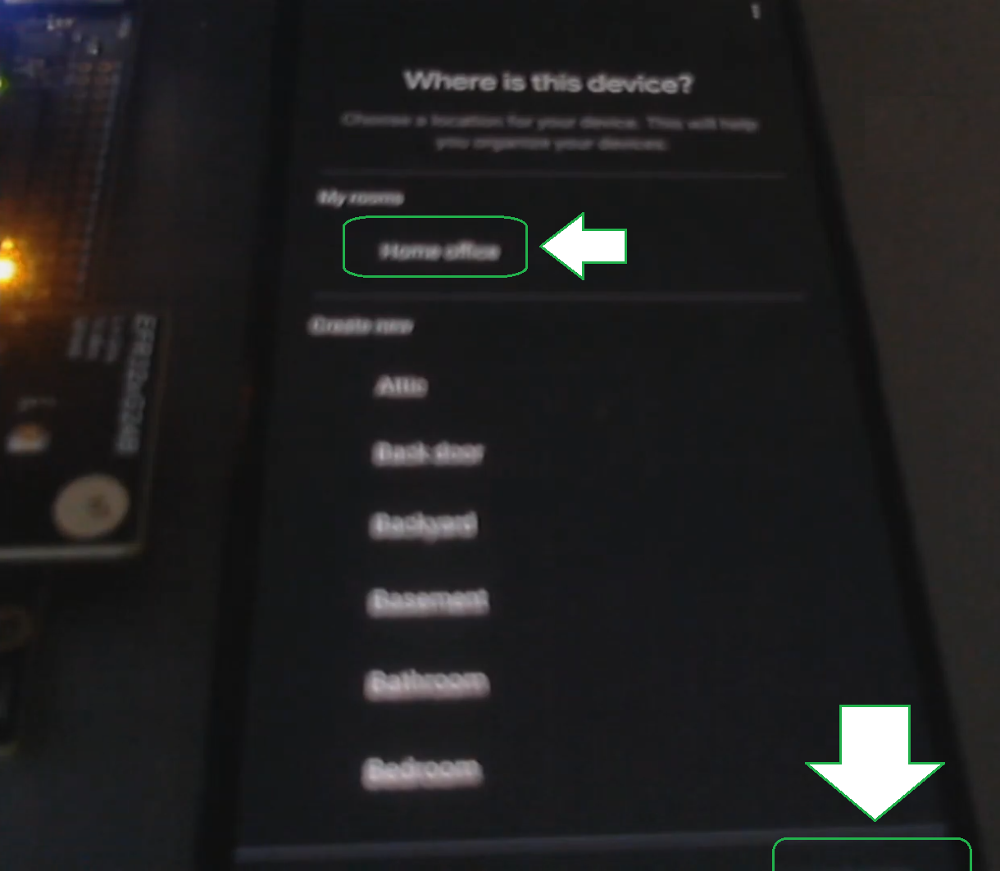
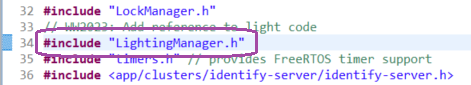

# Matter WorksWith 2023 MAT-204 Lock & Light MAD

## Overview

This tutorial provides an alternative to the video presentation for the WorksWith 2023, MAT-204 presentation: Smarter Home Designs with Matter and Thread.
We will go through the steps required to create a basic development environment for creating an MAD (Matter accessory device), test it with a Matter ecosystem hub and modify it to add new functionality.
The guide below will provide information to:
- Create a project from a sample app (lock example) and test it with your development hardware.
- Create a Matter integration in the Google Developer Console.
- Update your project to match your integration and test the sample project with it.
- Modify the project to add new functionality (adding a light).
- Test again your project using both functionalities with your Matter ecosystem hub.

## WorksWith 2023 MAT-204 presentation

You can view the WorksWith 2023 MAT-204 presentation [here](https://www.silabs.com/support/training/matter-device-development) and read the slides [here](https://www.silabs.com/documents/public/presentations/mat-204-smarter-home-designs-with-matter-and-thread.pdf) (PDF).

## Software Requirements

This example relies on the following software:
- Simplicity Studio 5; _version SV5.7.0.1_.
- Silicon Labs GSDK (Gecko Software Development Kit); _version 4.3.0_.
- Silicon Labs MGE (Matter GSDK Extension); _version 2.0.0-1.1_.

## Hardware Requirements

This example requires:
- A hardware development board:
  - This example uses the [BRD4186C](https://www.silabs.com/development-tools/wireless/xg24-rb4186c-efr32xg24-wireless-gecko-radio-board "BRD4186C") with a WSTK
- Google Nest Hub (2nd gen)
- Android smartphone running GHA (Google Home App)
  - Already connected to your Nest Hub

## Supplemental Requirements

This example requires:
- A wireless network with Internet access for your Matter ecosystem hub and Android device to use.
- An account for [Google's Developer Console](https://console.home.google.com/ "Google's Developer Console").
  - Make sure the account used for the _Developer Console_, your Matter ecosystem hub and your Android device are the same or linked together properly to allow access.

## Guide

### Step 1 - Getting started

#### Creating the sample project of a lock over thread

Start by creating a sample project using the New Project Wizard.


Make sure to select the following information:
- Choose your target board; this example uses the _BRD4186C_.
- Select the desired SDK; this example uses _Gecko SDK Stuide v4.3.0_.
- Select the IDE / Toolchain; this example uses _Simplicity IDE / GNU ARM v10.3.1_.


The final result should look something like this:


Select the sample project using the filter keywords and checkboxes, choosing _Matter - SoC Lock over Thread_.


Name the project and make sure _Link sdk and copy project sources_.


#### Compile the project and upload to test board

From the contextual menu of the project, select _Build Project_.


Open up the _Simplicity Commander_ tool from _Simplicity Studio_.


Choose the board you wish to work on; they are identified by a unique serial number.


Go to the _Flash_ section and clear the flash of the test device to ensure the removal of any previous testing, commissioning data, etc.


Upload a pre-compiled bootloader firmware binary and the firmware binary of the test project.
- A compatible bootloader firmware binary file is available with this example [here (s37)](/bootloader-storage-spiflash-single-1024k-BRD4186C-gsdk4.1.s37 "bootloader storage spiflash single 1024k BRD4186C gsdk4.1").
- You can find the binary of your example application in the project folder under the _GNU ARM v10.3.1 - Default_ folder.


### Step 2 - Testing with an ecosystem

#### Creating the project and Matter integration

Log into your _Google Developer Console_ and _Create a project_.


Name your project and click on _Create project_.


From the sidebar, click _Develop_.


Click on _Add integration_.


Click on _Next: Develop_.


Click _Next: Setup_.


Enter a product name and select the device type _Lock_.


Select the vendor ID to be a _Test VID_ and choose _0xFFF1_ from the dropdown.


Click on _Save & continue_.


You should now see your new integration listed under _Develop_.


#### Modifying the example project to match the vendor & product information

From Simplicity Studio, open the project file by double-clicking the .slcp and browse to the _Zigbee Cluster Configurator_ under _Configuration Tools_.


Select endpoint 0, choose _Enabled Clusters_ from the filter dropdown and scroll to _Basic Information_. Then, click the gear on the right to open the configuration page for this cluster.


Under the _Attributes_ tab, modify the following four attributes:
- VendorName; our example uses Silabs.
- VendorIDl; our example uses 0xFFF1.
- ProductName; SilabsTestLock.
- ProductID; 0x8006.

Note: make sure to use the same information you entered for the _Matter integration_ in the _Google Developer Console_ earlier.


Like in the previous step, compile the project and upload your new project firmware binary to your test device to update it with the newest changes. See the details [here](#compile-the-project-and-upload-to-test-board).

#### Testing with the ecosystem hub

From your Android device, open the GHA.


Select the devices icon.


Click on the _Add_ button.


Choose to set up a new Matter-enabled device.


Choose a location for the new device.


Your Android device will now search for Matter devices.


Once a device is found, click the bottom right button to add it.


Click on the middle button to open the camera and scan the QR code on the LCD screen.


Click on the button to agree to add this device to your account.


The Android device will now search for the test MAD.


Eventually, it will connect to the device.


Generate the Matter credentials.


Connect the test MAD to the network.


Check the test MAD network connectivity.


Connect the test MAD to the Google Home.


And finally display a message indicating the test MAD is now connected.


You will need to choose a location for your test MAD.



You can then change the name of the test MAD.


The Android device will indicate the test MAD is getting ready.


Finally, you'll be in your devices list and you should see your new test MAD, a lock device type.


Clicking the device's icon will toggle its lock status. The image on the LCD and the LED next to it will change to match the new state.
You can also use the matching button on the WSTK to toggle the status of the LCD, LED and device icon on the Android device, too.


### Step 3 - Adding an extra endpoint

#### Adding a prerequisite software component

From Simplicity Studio, open the project file by double-clicking the .slcp and use the filters to find and install the _Level Control Server Cluster_ under _Software Components_.


#### Creating the new endpoint

Then, open the _Zigbee Cluster Configurator_ under _Configuration Tools_.


Click on _Add New Endpoint_ and select the _Matter Dimmable Light (0x0101) from the dropdown. Then, click _Create_ to add the new endpoint.


#### Configuring the new endpoint

Change the filter to _Enabled Clusters_.


Open the configurations for the _Identify_ cluster.


Under _Attributes_ turn off the following four attributes:
- GeneratedCommandList
- AcceptedCommandList
- EventList
- AttributeList


Under _Attribute Reporting_ change the _IdentifyTime_ and _ClusterRevision_ values for _Min Interval_ to 0.


Open the configurations for the _Groups_ cluster.

Under _Attributes_ turn off the following four attributes:
- GeneratedCommandList
- AcceptedCommandList
- EventList
- AttributeList

Under _Attribute Reporting_ change the _NameSupport and _CluisterRevision_ values for _Min Interval_ to 0.


Disable the _Scenes_ cluster by selecting _Not Enabled_ in the dropdown on the down. It will be removed from the list.


Open the configurations for the _On/Off_ cluster.

Under _Attributes_ turn off the following four attributes:
- GeneratedCommandList
- AcceptedCommandList
- EventList
- AttributeList

Change the _OnOff_ and _StartUpOnOff_ values for _Storage Option_ to _NVM_ from the dropdowns. Also, change the _StartUpOnOff_ value for _Default_ to 0xFF.
Note: You can ignore the out-of-range error, it is simply a UI glitch that will be corrected in a future update.

Finally, change the _FeatureMap_ value for _Default_ to 1.


Under _Attribute Reporting_, enable the _OnOff_ attribute.
Note: If any attribute is grayed out or otherwise you are unable to turn it on, simply go back to the _Attributes_ section and toggle the attribute off then on again.


Finally, change the _Min Interval_ value to 0 for the attributes shown below.


Open the configurations for the _Level Control_ cluster.

Under _Attributes_ turn on the following four attributes:
- _MinLevel_
- _MaxLevel_
- _CurrentFrequency_
- _MinFrequency_
- _MaxFrequency_
- _OnOffTransitionTime

Change the _CurrentLevel_ value for _Storage Option_ to _NVM_.

Change the _Default_ value of _CurrentLevel_ and _MinLevel_ to 0x01 and the _Default_ value of _OnLevel_ to 0xFF.


Under _Attributes_ turn on the following four attributes:
- _OnTransitionTime_
- _OffTransitionTime_
- _DefaultMoveRate_

Under _Attributes_ turn off the following four attributes:
- GeneratedCommandList
- AcceptedCommandList
- EventList
- AttributeList

Change the _StartUpCurrentLevel_ value for _Storage Option_ to _NVM_.

Change the _Default_ value for _DefaultMoveRate_ to 50, _StartUpCurrentLevel_ to 0xFF and _FeatureMap_ to 3.


Under _Attribute Reporting_ change the _Min Interval_ value for _CurrentLevel_, _RemainingTime_, _Options_, _StartUpCurrentLevel_ and _ClusterRevision_ to 0.


Open the configurations for the _Descriptor_ cluster.

Under _Attributes_ turn off the following four attributes:
- GeneratedCommandList
- AcceptedCommandList
- EventList
- AttributeList

Change the _ClusterRevision_ value for _Storage Option_ to _External_.

#### Modifying the application code to integrate the light endpoint


Add the LightingManager.h and .cpp files to your project's _include_ and _src_ project respectively.
Note: You can get a copy of those files by creating a sample lighting project. You can also get a copy of the .h [here](matter_thread_ww2023_mat-204_lock_light_mad/include/LightingManager.h) and the .cpp [here](matter_thread_ww2023_mat-204_lock_light_mad/src/LightingManager.cpp).


#### Modifying LightningManager.cpp

Modify the endpoint value from 1 to 2.


#### Modifying AppEvent.h

Add in the light event type and struct.


#### Modifying AppTask.h

Add an include for the _LightingManager.h_.



Add missing function to manage the light endpoint.


#### Modifying AppTask.cpp

Add include for the _On/Off_ cluster server.


Add a _define_ for the new LED. We'll be using LED 0, which is currently used as a status LED.


Add an LEDWidget to display the light endpoint status.


Add initialization code for the new callbacks.


Add the event handler for the light endpoint.


Modify the button event handler to add a case for toggling the light endpoint status (on/off).


Add the code to initiate a light endpoint action.


Add the code to complete the light endpoint action.


Add code to handle events after the light action request.


Finally, add code to handle the light endpoint update to the on/off cluster.
Note: make sure to change the endpoint number from 1 to 2.


#### Modifying ZclCallbacks.cpp

Add an include for the _LightingManager.h_.


Add the namespace.
Note: This may not be required, but was used by the lighting example and thus left it as-is.


Modify the Matter attribute callback to handle the light endpoint case.
We will add code for the dimming control but will not implement this feature in this tutorial.


Finally, add code for the On/Off cluster init callback.
Note: This function is not used in this example but is required to exist.


#### Modifying BaseApplication.cpp

Use the references search function to find the _BaseApplication.cpp_ file under _matter_2.0.0/examples/platform/silabs/efr32/BaseApplication.cpp_.


Comment out the _LEDWidget_ for the status LED.


Comment out the initialization for the status LED _LEDWidget_.


Finally, comment out all uses of that _LEDWidget_.


#### Modifying demo-ui.c

You can find _demo-ui.c_ under _matter_2.0.0/examples/platform/silabs/display/demo-ui.c_.

Add four new constants to define new images for the LCD to display the states of both endpoints (lock & light) simultaneously.


Modify the code to handle the display app function to allow for four states instead of only two.


Modify the call to add a second boolean operator to it (false on screen clear).


#### Modifying demo-ui.h

You can find _demo-ui.h_ under _matter_2.0.0/examples/platform/silabs/display/demo-ui.h_.

Modify the signature of function _demoUIDisplayApp_ to include two boolean arguments instead of one.


#### Modifying lcd.cpp

You can find lcd.cpp_ under _matter_2.0.0/examples/platform/silabs/display/lcd.cpp_.

Modify the initialization code to allow for two states to be set.


Modify the _WriteDemoUI_ function to have two boolean arguments and so it can handle the two states.


Finally, modify _WriteDemoUI_ to the call to _demoUIDisplayApp_ now passes both states instead of one.


#### Modifying lcd.h

You can find lcd.h_ under _matter_2.0.0/examples/platform/silabs/display/lcd.h_.

Modify the signature of function _WriteDemoUI_ to handle two boolean arguments instead of one.


Modify the code to handle two states instead of one.


#### Modifying AppTask.cpp (again)

Modify calls to _WriteDemoUI_ to handle the two boolean arguments.


#### Modifying AppConfig.h

Add the images below to the header file.

```
#define LOCK_BULB_00                                                                                                                \
    0x00, 0x00, 0x00, 0x00, 0x00, 0x00, 0x00, 0x00, 0x00, 0x00, 0x00, 0x00, 0x00, 0x00, 0x00, 0x00, 0x00, 0x00, 0x00, 0x00,         \
        0x00, 0x00, 0x00, 0x00, 0x00, 0x00, 0x00, 0x00, 0x00, 0x00, 0x00, 0x00, 0x00, 0x00, 0x00, 0x00, 0x00, 0x00, 0x00, 0x00,     \
        0x00, 0x00, 0x00, 0x00, 0x00, 0x00, 0x00, 0x00, 0x00, 0x00, 0x00, 0x00, 0x00, 0x00, 0x00, 0x00, 0x00, 0x00, 0x00, 0x00,     \
        0x00, 0x00, 0x00, 0x00, 0x00, 0x00, 0x00, 0x00, 0x00, 0x00, 0x00, 0x00, 0x00, 0x00, 0x00, 0x00, 0x00, 0x00, 0x00, 0x00,     \
        0x00, 0xF0, 0x0F, 0x00, 0x00, 0x00, 0x00, 0x00, 0x00, 0xF8, 0x1F, 0x00, 0x00, 0x00, 0x00, 0x00, 0x00, 0xFE, 0x7F, 0x00,     \
        0x00, 0x00, 0x00, 0x00, 0x00, 0xFF, 0xFF, 0x00, 0x00, 0x00, 0x00, 0x00, 0x80, 0x1F, 0xF8, 0x01, 0x00, 0x00, 0x00, 0x00,     \
        0x80, 0x07, 0xE0, 0x01, 0x00, 0x00, 0x00, 0x00, 0xC0, 0x03, 0xC0, 0x03, 0x00, 0x00, 0x00, 0x00, 0xC0, 0x03, 0xC0, 0x03,     \
        0x00, 0xF0, 0x0F, 0x00, 0xE0, 0x01, 0x80, 0x07, 0x00, 0xFE, 0x7F, 0x00, 0xE0, 0x01, 0x80, 0x07, 0x00, 0x1F, 0xF8, 0x00,     \
        0x00, 0x00, 0x80, 0x07, 0x80, 0x03, 0xC0, 0x01, 0x00, 0x00, 0x80, 0x07, 0xC0, 0x01, 0x00, 0x03, 0x00, 0x00, 0x80, 0x07,     \
        0xC0, 0x00, 0x00, 0x03, 0x00, 0x00, 0x80, 0x07, 0x60, 0x00, 0x00, 0x06, 0x00, 0x00, 0x80, 0x07, 0x30, 0x00, 0x00, 0x0C,     \
        0x00, 0x00, 0x80, 0x07, 0x30, 0x00, 0x00, 0x0C, 0x00, 0x00, 0x80, 0x07, 0x30, 0x00, 0x00, 0x0C, 0x00, 0x00, 0x80, 0x07,     \
        0x18, 0x00, 0x00, 0x18, 0x00, 0x00, 0x80, 0x07, 0x18, 0x00, 0x00, 0x18, 0x00, 0x00, 0x80, 0x07, 0x18, 0x00, 0x00, 0x18,     \
        0x00, 0x00, 0x80, 0x07, 0x18, 0x00, 0x00, 0x18, 0x00, 0x00, 0x80, 0x07, 0x18, 0x00, 0x00, 0x18, 0x00, 0x00, 0x80, 0x07,     \
        0x18, 0x00, 0x00, 0x18, 0x00, 0x00, 0x80, 0x07, 0x30, 0x00, 0x00, 0x0C, 0x00, 0x00, 0x80, 0x07, 0x30, 0x00, 0x00, 0x0C,     \
        0x00, 0x00, 0x80, 0x07, 0x30, 0x00, 0x00, 0x0C, 0x00, 0x00, 0x80, 0x07, 0x60, 0x00, 0x00, 0x06, 0xFC, 0xFF, 0xFF, 0x3F,     \
        0x60, 0x00, 0x00, 0x06, 0xFE, 0xFF, 0xFF, 0x7F, 0xC0, 0x00, 0x00, 0x03, 0xFE, 0xFF, 0xFF, 0x7F, 0x80, 0x01, 0x80, 0x01,     \
        0xFE, 0xFF, 0xFF, 0x7F, 0x80, 0x03, 0xC0, 0x01, 0xFE, 0xFF, 0xFF, 0x7F, 0x00, 0x03, 0xC0, 0x00, 0xFE, 0xFF, 0xFF, 0x7F,     \
        0x00, 0x03, 0xC0, 0x00, 0xFE, 0xFF, 0xFF, 0x7F, 0x00, 0x06, 0x60, 0x00, 0xFE, 0xFF, 0xFF, 0x7F, 0x00, 0x06, 0x60, 0x00,     \
        0xFE, 0xFF, 0xFF, 0x7F, 0x00, 0x06, 0x60, 0x00, 0xFE, 0x3F, 0xFC, 0x7F, 0x00, 0x06, 0x60, 0x00, 0xFE, 0x1F, 0xF8, 0x7F,     \
        0x00, 0x06, 0x60, 0x00, 0xFE, 0x0F, 0xF0, 0x7F, 0x00, 0x06, 0x60, 0x00, 0xFE, 0x0F, 0xF0, 0x7F, 0x00, 0xFE, 0x7F, 0x00,     \
        0xFE, 0x0F, 0xF0, 0x7F, 0x00, 0xFC, 0x3F, 0x00, 0xFE, 0x0F, 0xF0, 0x7F, 0x00, 0x00, 0x00, 0x00, 0xFE, 0x1F, 0xF8, 0x7F,     \
        0x00, 0xFC, 0x3F, 0x00, 0xFE, 0x3F, 0xFC, 0x7F, 0x00, 0xF8, 0x1F, 0x00, 0xFE, 0xFF, 0xFF, 0x7F, 0x00, 0x00, 0x00, 0x00,     \
        0xFE, 0xFF, 0xFF, 0x7F, 0x00, 0xFC, 0x3F, 0x00, 0xFE, 0xFF, 0xFF, 0x7F, 0x00, 0xF8, 0x1F, 0x00, 0xFE, 0xFF, 0xFF, 0x7F,     \
        0x00, 0x00, 0x00, 0x00, 0xFE, 0xFF, 0xFF, 0x7F, 0x00, 0xF8, 0x1F, 0x00, 0xFE, 0xFF, 0xFF, 0x7F, 0x00, 0xF0, 0x0F, 0x00,     \
        0xFE, 0xFF, 0xFF, 0x7F, 0x00, 0x00, 0x00, 0x00, 0xFE, 0xFF, 0xFF, 0x7F, 0x00, 0xE0, 0x07, 0x00, 0xFC, 0xFF, 0xFF, 0x3F,     \
        0x00, 0xC0, 0x03, 0x00, 0x00, 0x00, 0x00, 0x00, 0x00, 0x00, 0x00, 0x00,     \

#define LOCK_BULB_10                                                                                                                \
    0x00, 0x00, 0x00, 0x00, 0x00, 0x00, 0x00, 0x00, 0x00, 0x00, 0x00, 0x00, 0x00, 0x00, 0x00, 0x00, 0x00, 0x00, 0x00, 0x00,         \
        0x00, 0x00, 0x00, 0x00, 0x00, 0x00, 0x00, 0x00, 0x00, 0x00, 0x00, 0x00, 0x00, 0x00, 0x00, 0x00, 0x00, 0x00, 0x00, 0x00,     \
        0x00, 0x00, 0x00, 0x00, 0x00, 0x00, 0x00, 0x00, 0x00, 0x00, 0x00, 0x00, 0x00, 0x00, 0x00, 0x00, 0x00, 0x00, 0x00, 0x00,     \
        0x00, 0x00, 0x00, 0x00, 0x00, 0x00, 0x00, 0x00, 0x00, 0x00, 0x00, 0x00, 0x00, 0x00, 0x00, 0x00, 0x00, 0x00, 0x00, 0x00,     \
        0x00, 0xF0, 0x0F, 0x00, 0x00, 0x00, 0x00, 0x00, 0x00, 0xF8, 0x1F, 0x00, 0x00, 0x00, 0x00, 0x00, 0x00, 0xFE, 0x7F, 0x00,     \
        0x00, 0x00, 0x00, 0x00, 0x00, 0xFF, 0xFF, 0x00, 0x00, 0x00, 0x00, 0x00, 0x80, 0x1F, 0xF8, 0x01, 0x00, 0x00, 0x00, 0x00,     \
        0x80, 0x07, 0xE0, 0x01, 0x00, 0x00, 0x00, 0x00, 0xC0, 0x03, 0xC0, 0x03, 0x00, 0x00, 0x00, 0x00, 0xC0, 0x03, 0xC0, 0x03,     \
        0x00, 0xF0, 0x0F, 0x00, 0xE0, 0x01, 0x80, 0x07, 0x00, 0xFE, 0x7F, 0x00, 0xE0, 0x01, 0x80, 0x07, 0x00, 0x1F, 0xF8, 0x00,     \
        0xE0, 0x01, 0x80, 0x07, 0x80, 0x03, 0xC0, 0x01, 0xE0, 0x01, 0x80, 0x07, 0xC0, 0x01, 0x00, 0x03, 0xE0, 0x01, 0x80, 0x07,     \
        0xC0, 0x00, 0x00, 0x03, 0xE0, 0x01, 0x80, 0x07, 0x60, 0x00, 0x00, 0x06, 0xE0, 0x01, 0x80, 0x07, 0x30, 0x00, 0x00, 0x0C,     \
        0xE0, 0x01, 0x80, 0x07, 0x30, 0x00, 0x00, 0x0C, 0xE0, 0x01, 0x80, 0x07, 0x30, 0x00, 0x00, 0x0C, 0xE0, 0x01, 0x80, 0x07,     \
        0x18, 0x00, 0x00, 0x18, 0xE0, 0x01, 0x80, 0x07, 0x18, 0x00, 0x00, 0x18, 0xE0, 0x01, 0x80, 0x07, 0x18, 0x00, 0x00, 0x18,     \
        0xE0, 0x01, 0x80, 0x07, 0x18, 0x00, 0x00, 0x18, 0xE0, 0x01, 0x80, 0x07, 0x18, 0x00, 0x00, 0x18, 0xE0, 0x01, 0x80, 0x07,     \
        0x18, 0x00, 0x00, 0x18, 0xE0, 0x01, 0x80, 0x07, 0x30, 0x00, 0x00, 0x0C, 0xE0, 0x01, 0x80, 0x07, 0x30, 0x00, 0x00, 0x0C,     \
        0xE0, 0x01, 0x80, 0x07, 0x30, 0x00, 0x00, 0x0C, 0xE0, 0x01, 0x80, 0x07, 0x60, 0x00, 0x00, 0x06, 0xFC, 0xFF, 0xFF, 0x3F,     \
        0x60, 0x00, 0x00, 0x06, 0xFE, 0xFF, 0xFF, 0x7F, 0xC0, 0x00, 0x00, 0x03, 0xFE, 0xFF, 0xFF, 0x7F, 0x80, 0x01, 0x80, 0x01,     \
        0xFE, 0xFF, 0xFF, 0x7F, 0x80, 0x03, 0xC0, 0x01, 0xFE, 0xFF, 0xFF, 0x7F, 0x00, 0x03, 0xC0, 0x00, 0xFE, 0xFF, 0xFF, 0x7F,     \
        0x00, 0x03, 0xC0, 0x00, 0xFE, 0xFF, 0xFF, 0x7F, 0x00, 0x06, 0x60, 0x00, 0xFE, 0xFF, 0xFF, 0x7F, 0x00, 0x06, 0x60, 0x00,     \
        0xFE, 0xFF, 0xFF, 0x7F, 0x00, 0x06, 0x60, 0x00, 0xFE, 0x3F, 0xFC, 0x7F, 0x00, 0x06, 0x60, 0x00, 0xFE, 0x1F, 0xF8, 0x7F,     \
        0x00, 0x06, 0x60, 0x00, 0xFE, 0x0F, 0xF0, 0x7F, 0x00, 0x06, 0x60, 0x00, 0xFE, 0x0F, 0xF0, 0x7F, 0x00, 0xFE, 0x7F, 0x00,     \
        0xFE, 0x0F, 0xF0, 0x7F, 0x00, 0xFC, 0x3F, 0x00, 0xFE, 0x0F, 0xF0, 0x7F, 0x00, 0x00, 0x00, 0x00, 0xFE, 0x1F, 0xF8, 0x7F,     \
        0x00, 0xFC, 0x3F, 0x00, 0xFE, 0x3F, 0xFC, 0x7F, 0x00, 0xF8, 0x1F, 0x00, 0xFE, 0xFF, 0xFF, 0x7F, 0x00, 0x00, 0x00, 0x00,     \
        0xFE, 0xFF, 0xFF, 0x7F, 0x00, 0xFC, 0x3F, 0x00, 0xFE, 0xFF, 0xFF, 0x7F, 0x00, 0xF8, 0x1F, 0x00, 0xFE, 0xFF, 0xFF, 0x7F,     \
        0x00, 0x00, 0x00, 0x00, 0xFE, 0xFF, 0xFF, 0x7F, 0x00, 0xF8, 0x1F, 0x00, 0xFE, 0xFF, 0xFF, 0x7F, 0x00, 0xF0, 0x0F, 0x00,     \
        0xFE, 0xFF, 0xFF, 0x7F, 0x00, 0x00, 0x00, 0x00, 0xFE, 0xFF, 0xFF, 0x7F, 0x00, 0xE0, 0x07, 0x00, 0xFC, 0xFF, 0xFF, 0x3F,     \
        0x00, 0xC0, 0x03, 0x00, 0x00, 0x00, 0x00, 0x00, 0x00, 0x00, 0x00, 0x00,     \

#define LOCK_BULB_01                                                                                                                \
    0x00, 0x00, 0x00, 0x00, 0x00, 0x00, 0x00, 0x00, 0x00, 0x00, 0x00, 0x00, 0x10, 0x08, 0x10, 0x08, 0x00, 0x00, 0x00, 0x00,         \
        0x10, 0x08, 0x10, 0x08, 0x00, 0x00, 0x00, 0x00, 0x10, 0x08, 0x10, 0x08, 0x00, 0x00, 0x00, 0x00, 0x20, 0x10, 0x08, 0x04,     \
        0x00, 0x00, 0x00, 0x00, 0x20, 0x10, 0x08, 0x04, 0x00, 0x00, 0x00, 0x00, 0x20, 0x10, 0x08, 0x04, 0x00, 0x00, 0x00, 0x00,     \
        0x40, 0x10, 0x08, 0x02, 0x00, 0x00, 0x00, 0x00, 0x40, 0x20, 0x04, 0x02, 0x00, 0x00, 0x00, 0x00, 0x80, 0x20, 0x04, 0x01,     \
        0x00, 0xF0, 0x0F, 0x00, 0x80, 0x20, 0x04, 0x01, 0x00, 0xF8, 0x1F, 0x00, 0x80, 0x20, 0x04, 0x01, 0x00, 0xFE, 0x7F, 0x00,     \
        0x00, 0x41, 0x82, 0x00, 0x00, 0xFF, 0xFF, 0x00, 0x04, 0x41, 0x82, 0x20, 0x80, 0x1F, 0xF8, 0x01, 0x04, 0x41, 0x82, 0x20,     \
        0x80, 0x07, 0xE0, 0x01, 0x08, 0x02, 0x40, 0x10, 0xC0, 0x03, 0xC0, 0x03, 0x08, 0x02, 0x40, 0x10, 0xC0, 0x03, 0xC0, 0x03,     \
        0x10, 0xF0, 0x0F, 0x08, 0xE0, 0x01, 0x80, 0x07, 0x10, 0xFE, 0x7F, 0x08, 0xE0, 0x01, 0x80, 0x07, 0x20, 0x1F, 0xF8, 0x04,     \
        0x00, 0x00, 0x80, 0x07, 0x80, 0x03, 0xC0, 0x01, 0x00, 0x00, 0x80, 0x07, 0xC0, 0x01, 0x80, 0x03, 0x00, 0x00, 0x80, 0x07,     \
        0xC0, 0x00, 0x00, 0x03, 0x00, 0x00, 0x80, 0x07, 0x60, 0x00, 0x00, 0x06, 0x00, 0x00, 0x80, 0x07, 0x30, 0x00, 0x00, 0x0C,     \
        0x00, 0x00, 0x80, 0x07, 0x30, 0x00, 0x00, 0x0C, 0x00, 0x00, 0x80, 0x07, 0x30, 0x00, 0x00, 0x0C, 0x00, 0x00, 0x80, 0x07,     \
        0x18, 0x3C, 0x20, 0x18, 0x00, 0x00, 0x80, 0x07, 0x18, 0x66, 0x24, 0x18, 0x00, 0x00, 0x80, 0x07, 0x18, 0x42, 0x24, 0x18,     \
        0x00, 0x00, 0x80, 0x07, 0x18, 0x42, 0x28, 0x18, 0x00, 0x00, 0x80, 0x07, 0x18, 0x42, 0x28, 0x18, 0x00, 0x00, 0x80, 0x07,     \
        0x18, 0x42, 0x30, 0x18, 0x00, 0x00, 0x80, 0x07, 0x30, 0x66, 0x30, 0x0C, 0x00, 0x00, 0x80, 0x07, 0x30, 0x3C, 0x20, 0x0C,     \
        0x00, 0x00, 0x80, 0x07, 0x30, 0x00, 0x00, 0x0C, 0x00, 0x00, 0x80, 0x07, 0x60, 0x00, 0x00, 0x06, 0xFC, 0xFF, 0xFF, 0x3F,     \
        0x60, 0x00, 0x00, 0x06, 0xFE, 0xFF, 0xFF, 0x7F, 0xC0, 0x00, 0x00, 0x03, 0xFE, 0xFF, 0xFF, 0x7F, 0x80, 0x01, 0x80, 0x01,     \
        0xFE, 0xFF, 0xFF, 0x7F, 0x80, 0x03, 0xC0, 0x01, 0xFE, 0xFF, 0xFF, 0x7F, 0x00, 0x03, 0xC0, 0x00, 0xFE, 0xFF, 0xFF, 0x7F,     \
        0x00, 0x03, 0xC0, 0x00, 0xFE, 0xFF, 0xFF, 0x7F, 0x00, 0x06, 0x60, 0x00, 0xFE, 0xFF, 0xFF, 0x7F, 0x00, 0x06, 0x60, 0x00,     \
        0xFE, 0xFF, 0xFF, 0x7F, 0x00, 0x06, 0x60, 0x00, 0xFE, 0x3F, 0xFC, 0x7F, 0x00, 0x06, 0x60, 0x00, 0xFE, 0x1F, 0xF8, 0x7F,     \
        0x00, 0x06, 0x60, 0x00, 0xFE, 0x0F, 0xF0, 0x7F, 0x00, 0x06, 0x60, 0x00, 0xFE, 0x0F, 0xF0, 0x7F, 0x00, 0xFE, 0x7F, 0x00,     \
        0xFE, 0x0F, 0xF0, 0x7F, 0x00, 0xFC, 0x3F, 0x00, 0xFE, 0x0F, 0xF0, 0x7F, 0x00, 0x00, 0x00, 0x00, 0xFE, 0x1F, 0xF8, 0x7F,     \
        0x00, 0xFC, 0x3F, 0x00, 0xFE, 0x3F, 0xFC, 0x7F, 0x00, 0xF8, 0x1F, 0x00, 0xFE, 0xFF, 0xFF, 0x7F, 0x00, 0x00, 0x00, 0x00,     \
        0xFE, 0xFF, 0xFF, 0x7F, 0x00, 0xFC, 0x3F, 0x00, 0xFE, 0xFF, 0xFF, 0x7F, 0x00, 0xF8, 0x1F, 0x00, 0xFE, 0xFF, 0xFF, 0x7F,     \
        0x00, 0x00, 0x00, 0x00, 0xFE, 0xFF, 0xFF, 0x7F, 0x00, 0xF8, 0x1F, 0x00, 0xFE, 0xFF, 0xFF, 0x7F, 0x00, 0xF0, 0x0F, 0x00,     \
        0xFE, 0xFF, 0xFF, 0x7F, 0x00, 0x00, 0x00, 0x00, 0xFE, 0xFF, 0xFF, 0x7F, 0x00, 0xE0, 0x07, 0x00, 0xFC, 0xFF, 0xFF, 0x3F,     \
        0x00, 0xC0, 0x03, 0x00, 0x00, 0x00, 0x00, 0x00, 0x00, 0x00, 0x00, 0x00,     \

#define LOCK_BULB_11                                                                                                                \
    0x00, 0x00, 0x00, 0x00, 0x00, 0x00, 0x00, 0x00, 0x00, 0x00, 0x00, 0x00, 0x10, 0x08, 0x10, 0x08, 0x00, 0x00, 0x00, 0x00,         \
        0x10, 0x08, 0x10, 0x08, 0x00, 0x00, 0x00, 0x00, 0x10, 0x08, 0x10, 0x08, 0x00, 0x00, 0x00, 0x00, 0x20, 0x10, 0x08, 0x04,     \
        0x00, 0x00, 0x00, 0x00, 0x20, 0x10, 0x08, 0x04, 0x00, 0x00, 0x00, 0x00, 0x20, 0x10, 0x08, 0x04, 0x00, 0x00, 0x00, 0x00,     \
        0x40, 0x10, 0x08, 0x02, 0x00, 0x00, 0x00, 0x00, 0x40, 0x20, 0x04, 0x02, 0x00, 0x00, 0x00, 0x00, 0x80, 0x20, 0x04, 0x01,     \
        0x00, 0xF0, 0x0F, 0x00, 0x80, 0x20, 0x04, 0x01, 0x00, 0xF8, 0x1F, 0x00, 0x80, 0x20, 0x04, 0x01, 0x00, 0xFE, 0x7F, 0x00,     \
        0x00, 0x41, 0x82, 0x00, 0x00, 0xFF, 0xFF, 0x00, 0x04, 0x41, 0x82, 0x20, 0x80, 0x1F, 0xF8, 0x01, 0x04, 0x41, 0x82, 0x20,     \
        0x80, 0x07, 0xE0, 0x01, 0x08, 0x02, 0x40, 0x10, 0xC0, 0x03, 0xC0, 0x03, 0x08, 0x02, 0x40, 0x10, 0xC0, 0x03, 0xC0, 0x03,     \
        0x10, 0xF0, 0x0F, 0x08, 0xE0, 0x01, 0x80, 0x07, 0x10, 0xFE, 0x7F, 0x08, 0xE0, 0x01, 0x80, 0x07, 0x20, 0x1F, 0xF8, 0x04,     \
        0xE0, 0x01, 0x80, 0x07, 0x80, 0x03, 0xC0, 0x01, 0xE0, 0x01, 0x80, 0x07, 0xC0, 0x01, 0x80, 0x03, 0xE0, 0x01, 0x80, 0x07,     \
        0xC0, 0x00, 0x00, 0x03, 0xE0, 0x01, 0x80, 0x07, 0x60, 0x00, 0x00, 0x06, 0xE0, 0x01, 0x80, 0x07, 0x30, 0x00, 0x00, 0x0C,     \
        0xE0, 0x01, 0x80, 0x07, 0x30, 0x00, 0x00, 0x0C, 0xE0, 0x01, 0x80, 0x07, 0x30, 0x00, 0x00, 0x0C, 0xE0, 0x01, 0x80, 0x07,     \
        0x18, 0x3C, 0x20, 0x18, 0xE0, 0x01, 0x80, 0x07, 0x18, 0x66, 0x24, 0x18, 0xE0, 0x01, 0x80, 0x07, 0x18, 0x42, 0x24, 0x18,     \
        0xE0, 0x01, 0x80, 0x07, 0x18, 0x42, 0x28, 0x18, 0xE0, 0x01, 0x80, 0x07, 0x18, 0x42, 0x28, 0x18, 0xE0, 0x01, 0x80, 0x07,     \
        0x18, 0x42, 0x30, 0x18, 0xE0, 0x01, 0x80, 0x07, 0x30, 0x66, 0x30, 0x0C, 0xE0, 0x01, 0x80, 0x07, 0x30, 0x3C, 0x20, 0x0C,     \
        0xE0, 0x01, 0x80, 0x07, 0x30, 0x00, 0x00, 0x0C, 0xE0, 0x01, 0x80, 0x07, 0x60, 0x00, 0x00, 0x06, 0xFC, 0xFF, 0xFF, 0x3F,     \
        0x60, 0x00, 0x00, 0x06, 0xFE, 0xFF, 0xFF, 0x7F, 0xC0, 0x00, 0x00, 0x03, 0xFE, 0xFF, 0xFF, 0x7F, 0x80, 0x01, 0x80, 0x01,     \
        0xFE, 0xFF, 0xFF, 0x7F, 0x80, 0x03, 0xC0, 0x01, 0xFE, 0xFF, 0xFF, 0x7F, 0x00, 0x03, 0xC0, 0x00, 0xFE, 0xFF, 0xFF, 0x7F,     \
        0x00, 0x03, 0xC0, 0x00, 0xFE, 0xFF, 0xFF, 0x7F, 0x00, 0x06, 0x60, 0x00, 0xFE, 0xFF, 0xFF, 0x7F, 0x00, 0x06, 0x60, 0x00,     \
        0xFE, 0xFF, 0xFF, 0x7F, 0x00, 0x06, 0x60, 0x00, 0xFE, 0x3F, 0xFC, 0x7F, 0x00, 0x06, 0x60, 0x00, 0xFE, 0x1F, 0xF8, 0x7F,     \
        0x00, 0x06, 0x60, 0x00, 0xFE, 0x0F, 0xF0, 0x7F, 0x00, 0x06, 0x60, 0x00, 0xFE, 0x0F, 0xF0, 0x7F, 0x00, 0xFE, 0x7F, 0x00,     \
        0xFE, 0x0F, 0xF0, 0x7F, 0x00, 0xFC, 0x3F, 0x00, 0xFE, 0x0F, 0xF0, 0x7F, 0x00, 0x00, 0x00, 0x00, 0xFE, 0x1F, 0xF8, 0x7F,     \
        0x00, 0xFC, 0x3F, 0x00, 0xFE, 0x3F, 0xFC, 0x7F, 0x00, 0xF8, 0x1F, 0x00, 0xFE, 0xFF, 0xFF, 0x7F, 0x00, 0x00, 0x00, 0x00,     \
        0xFE, 0xFF, 0xFF, 0x7F, 0x00, 0xFC, 0x3F, 0x00, 0xFE, 0xFF, 0xFF, 0x7F, 0x00, 0xF8, 0x1F, 0x00, 0xFE, 0xFF, 0xFF, 0x7F,     \
        0x00, 0x00, 0x00, 0x00, 0xFE, 0xFF, 0xFF, 0x7F, 0x00, 0xF8, 0x1F, 0x00, 0xFE, 0xFF, 0xFF, 0x7F, 0x00, 0xF0, 0x0F, 0x00,     \
        0xFE, 0xFF, 0xFF, 0x7F, 0x00, 0x00, 0x00, 0x00, 0xFE, 0xFF, 0xFF, 0x7F, 0x00, 0xE0, 0x07, 0x00, 0xFC, 0xFF, 0xFF, 0x3F,     \
        0x00, 0xC0, 0x03, 0x00, 0x00, 0x00, 0x00, 0x00, 0x00, 0x00, 0x00, 0x00,     \
```


### Step 4 - Testing again with our new features

#### Compile the project and upload


Once the upload is complete, add your test MAD to your hub as you did previously [here](#Testing-with-the-ecosystem-hub).

#### Testing the new features

You'll notice a few differences with your modified test MAD.

First, it shows up as two icons in _GHA_, one light and one lock.
Pressing on the lock will icon toggle the lock state as it did previously, updating the LCD and associated LED to show the new status.
Pressing on the light icon will also toggle the status of the LCD to display the new light endpoint status and toggle the associated LED.


#### {END - Matter WorksWith 2023 MAT-204 Lock & Light MAD}
